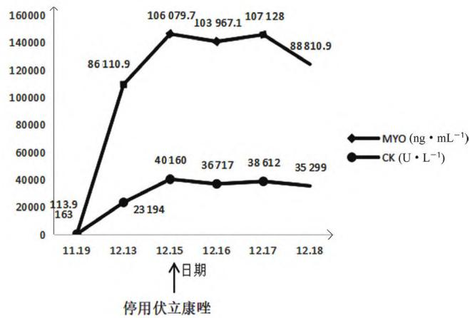

## 药品不良反应

# 1 例伏立康唑药物相互作用致横纹肌溶解的案例报道并文献分析

胡功利1 ，韩丽珠2 ，雷洋2 ，陶春1 ，黄玉1 ，肖溢1 ，边原2\*（1. 自贡市第四人民医院药剂科，四川　自贡643000；2. 四川省医学科学院·四川省人民医院/电子科技大学附属医院药学部个体化药物治疗四川省重点实验室，成都610072）

摘要：目的　探讨伏立康唑药物相互作用相关性肌损伤的临床特点，为该类不良反应的预防和药学监护提供参考。方法　分析我院1例伏立康唑联合阿托伐他汀致横纹肌溶解的病例，同时查阅国内外相关文献并进行综述分析。结果　我院1例肺曲霉菌感染合并颈动脉斑块患者使用伏立康唑联合阿托伐他汀治疗 15 d后出现横纹肌溶解早期症状，最终进展为多器官衰竭。文献分析提示伏立康唑与塞来昔布、他克莫司、甲泼尼龙、奥美拉唑、埃索美拉唑、阿托伐他汀联用时发生药物相关性肌病风险增加，主要表现为肌痛、肌无力、肌酸激酶升高，严重者出现横纹肌溶解，通常于用药后 12～15 d发生；有肝功能损害患者使用伏立康唑与奥美拉唑、埃索美拉唑、阿托伐他汀、阿托伐他汀联用时发生横纹肌溶解的风险更大，且大多预后不良。结论　使用伏立康唑时应充分评估合并用药和患者基础状况，密切监测患者伏立康唑血药浓度、肌酶及临床表现，警惕伏立康唑药物相互作用所致横纹肌溶解的严重罕见不良反应。

关键词：伏立康唑；横纹肌溶解；肌损伤；肌炎；药物相互作用

中图分类号：R969.3 文献标识码：B

文章编号：1672-2981(2023)04-1112-05

doi:10.7539/j.issn.1672-2981.2023.04.044

# Rhabdomyolysis caused by voriconazole drug interaction: a case report and literature analysis

HU Gong-li1 , HAN Li-zhu2 , LEI Yang2 , TAO Chun1 , HUANG Yu1 , XIAO Yi1 , BIAN Yuan2\* (1. Zigong Fourth People's Hospital, Zigong Sichuan 643000; 2. Department of Pharmacy & Key Laboratory of Personalized Drug Therapy in Sichuan Province, Sichuan Academy of Medical Sciences, Sichuan Provincial People’s Hospital/Affiliated Hospital of University of Electronic Science & Technology of China, Chengdu 610072)

Abstract: Objective To investigate the clinical characteristics of voriconazole drug interaction related muscle injury, and to provide reference for the prevention and pharmaceutical care of such adverse reactions. Methods Analysis of a case of rhabdomyolysis caused by vorlikonazole combined with rosuvastatin in our hospital, while access to relevant literature review. Results A patient with pulmonary aspergillus infection complicated with carotid plaque in our hospital developed early symptoms of rhabdomyolysis after 15 days of treatment with voriconazole combined with rosuvastatin, and eventually progressed to multiple organ failure. Literature analysis suggests voriconazole with celecoxib, tacrolimus, methylprednisolone, omeprazole, esso beauty pull azole, atorvastatin drug correlation to increased risk of myopathy, main show is higher muscle pain, muscle weakness, creatine kinase, appear serious rhabdomyolysis, usually from 12 d to 15 d before and after the medication; voriconazole combined with omeprazole, esomeprazole, atorvastatin and rosuvastatin has a higher risk of rhabdomyolysis in patients with liver damage, and most of them have a poor prognosis. Conclusion Voriconazole should be used to fully evaluate the combination of drug use and the patient's basic condition, closely monitor the patient's blood drug concentration, muscle enzyme and clinical manifestations of voriconazole, and guard against the severe and rare adverse reactions of rhabdomyolysis caused by voriconazole drug interaction.

Key words: voriconazole; rhabdomyolysis; muscle injury; myositis; drug interaction

伏立康唑属于第二代三唑类广谱抗真菌药物，是临床用于治疗侵袭性肺曲霉病和念珠菌血症的一线用药；体内代谢呈非线性药代动力学特征，经细胞色素 P450 酶（CYP）代谢，易发生药物相互作用，导致药物不良反应增加 [1]。阿托伐他汀是一种选择性羟甲基戊二酰辅酶A（b-hydroxyl-b-methylglutaryl coenzyme A，HMG-CoA）还原酶抑制剂，通过增加肝低密度脂蛋白（low-density lipoprotein，LDL）细胞表面受体数目，促进 LDL的吸收和分解代谢，抑制极低密度 脂 蛋 白（very low density lipoprotein，VLDL）在肝的合成，由此降低VLDL和LDL微粒的数量发挥调脂作用。目前与伏立康唑联用发生药物相互作用致肌损伤的文献报道较少。本研究报道1 例肺曲霉菌感染伴颈动脉斑块患者联用伏立康唑与阿托伐他汀相互作用致横纹肌溶解继发多器官衰竭的病例，并进行文献检索与分析，总结伏立康唑药物相互作用致肌损伤的特点，以提醒医务工作者警惕伏立康唑药物相互作用致横纹肌溶解的严重罕见不良反应，为该罕见且严重不良反应的防治与药学监护提供参考。

## 1　案例报道

患者，男，68 岁，身高 156 cm，体质量 75kg，体质量指数（BMI） $3 0 . 8 ~ \mathrm { k g } \cdot \mathrm { m } ^ { - 2 }$ ，2021 年11 月 19 日患者痰涂片见真菌孢子及菌丝，血清真菌细胞壁（1，3）- -D葡聚糖试验 232.97$\mathrm { p g } \cdot \mathrm { m L } ^ { - 1 } \uparrow$ ，曾在外院培养出曲霉菌，考虑肺部曲霉菌感染，予以伏立康唑第一日负荷剂量 450mg 后 300 mg 维持（ $\mathrm { \Phi _ { \mathrm { { q } 1 2 h \ i v g t } } ) }$ ）抗真菌治疗，颈动脉重度狭窄伴斑块形成，予以阿托伐他汀钙片10 mg qn 调脂、氯吡格雷片 75 mg qd 抗血小板聚集。用药前辅助检查肝肾功能及肌酶指标：白蛋白 $( \mathrm { \ A L B } ) 3 5 . 6 \mathrm { \ g \ ^ { - 1 } \downarrow }$ ，谷草转氨酶（AST）54$\mathrm { U } \cdot \mathrm { L } ^ { - 1 } \uparrow$ ，谷丙转氨酶（ALT）52 U·L－ 1 ↑，其余未见异常。2021 年 11 月 24 日检测伏立康唑血药浓度 $5 . 3 7 ~ { \mu \mathrm { g } } \cdot \mathrm { m L } ^ { - 1 }$ ，调整给药剂量为 200mg（q12h ivgtt）。2021 年 11 月 25 日 持 续 口 服伏立康唑片 200 mg q12h 抗真菌，多烯磷脂酰胆碱 456 mg tid 保 肝。2021 年 12 月 3 日 患 者 出 现四肢乏力、活动后胸闷气紧，2021 年 12 月 13 日患者上诉症状进一步加重入院。入院辅助检查：$\mathrm { A L B } 2 3 . 7 \mathrm { g } \cdot \mathrm { L } ^ { - 1 } \downarrow$ ，AST 596 U·L－ 1 ↑，ALT 122$\mathrm { ~ U ~ } ^ { \bullet } \mathrm { L } ^ { - 1 } \uparrow$ ，肌酸激酶 $( \mathrm { ~ C K ~ } ) ~ 2 3 ~ 1 9 4 ~ \mathrm { U } \cdot \mathrm { L } ^ { - 1 } \uparrow$ ，肌红蛋白 $( \mathrm { \ M Y O \ } ) \ 8 6 \ 1 1 0 . 9 \ \mathrm { n g \ } ^ { - } \ \mathrm { m L } ^ { - 1 } \uparrow$ ，高敏肌钙蛋白 I（cTnI）51.1 ng·L－ 1 ↑。既往有高血压病史6 年，近 1 个月使用缬沙坦 80 mg qd控制血压；慢性阻塞性肺疾病史1 月余，使用沙美特罗替卡松吸入剂（50/250）1 揿 bid改善症状；糖尿病史1 月余，使用格列美脲 4 mg qd、米格列醇 50 mgbid、磷酸西格列汀 100 mg qd控制血糖；无肌病史，无食物药物过敏史。入院诊断为：慢性肺源性心脏病、颈动脉重度狭窄伴斑块形成、肺曲霉菌病、2 型糖尿病伴周围神经损害、高血压病 3级很高危组、脂肪肝、肝功能异常。

患者入院后停用阿托伐他汀钙，继续予以伏立康唑片200 mg bid抗真菌，哌拉西林钠他唑巴坦钠4.5 g（q8h ivgtt）抗感染，盐酸氨溴索注射液 15 mg（q12h ivgtt）祛痰，沙美特罗替卡松吸入剂1揿bid吸入缓解气道痉挛，硫酸氢氯吡格雷片75 mg qd抗血小板聚集，异甘草酸镁注射液20 mL（qd ivgtt）保肝，缬沙坦 80 mg qd降压，格列美脲片 4 mg qd联合米格列醇片 50 mg tid和磷酸西格列汀片 100 mg qd 降糖治疗。2021 年 12 月 15 日患者诉四肢无力加重，全身酸痛，张口困难伴下颌部肌肉疼痛，尿量450 mL，复查肝肾功能及肌酶：肾小球滤过率 $( \mathrm { \ e G F R } ) \ 4 6 . 8 \ \mathrm { m L } \cdot \mathrm { m i n } ^ { - 1 } \downarrow$ ，血肌肝 $( { \mathrm { ~ S c r ~ } } ) \ 1 3 3 . 4 \ \mu { \mathrm { m o l } } \bullet { \mathrm { ~ L } } ^ { - 1 } \uparrow , \ { \mathrm { A L B } } \ 2 4 . 1 \ \mathrm { g } \bullet { \mathrm { ~ L } } ^ { - 1 } \downarrow$ ，AST 998 U·L－ 1 ↑，ALT 199 U·L－ 1 ↑，CK 40 160$\mathrm { U } \cdot \mathrm { L } ^ { - 1 } \uparrow$ ， $\mathrm { M Y O ~ 1 0 6 ~ 0 7 9 . 9 ~ n g \cdot m L ^ { - } }$ 1 ↑，cTnI 61.7$\mathrm { n g } \cdot \mathrm { L } ^ { - 1 } \uparrow$ 。磁共振提示左上臂、左大腿、左小腿中上段肌群T2信号增高，临床药师查阅文献告知临床医师怀疑伏立康唑与阿托伐他汀相互作用导致肌损伤，建议停用伏立康唑，临床医师采纳临床药师建议，立即停用伏立康唑，先后予以碳酸氢钠碱化尿液，复方醋酸钠林格注射液和转化糖电解质注射液补液，甲泼尼龙抗炎、床旁连续性肾脏替代治疗（CRRT）等对症支持治疗。上述方案治疗4 d，患者肌酶指标有所下降，但出现肝酶、血钾、肌酐、尿素氮、乳酸进行性升高，尿量进行性减少，茶色尿，逐渐发展至无尿，最终导致急性肝肾衰竭；同时凝血功能恶化，凝血酶原时间（PT）16.4 s↑，活化部分凝血活酶时间（APTT）41.8 s↑，纤维蛋白原降解产物（FDP）29.6 mg·L－ 1 ↑，2021 年 12 月18日患者处于昏迷状态，病情危重，患者家属要求自动出院。出院诊断为：横纹肌溶解综合征、急性肾损伤、肺曲霉菌病、肝功能不全、低蛋白血症、高血压病3级很高危组、2型糖尿病伴周围神经损害。患者住院期间肌酶变化趋势见图1。

line chart

| 日期 | MYO (ng·mL⁻¹) | CK (U·L⁻¹) |
|---|---|---|
| 11.19 | 0 | 163 |
| 12.13 | 110900 | 23194 |
| 12.15 | 147000 | 40160 |
| 12.16 | 142000 | 36717 |
| 12.17 | 147000 | 38612 |
| 12.18 | 123000 | 35299 |
↑日期
停用伏立康唑
↑
MYO (ng·mL⁻¹)
↓
CK (U·L⁻¹)

图 1　患者住院期间肌酶变化趋势图  
Fig 1 Trend chart of creatinine changes during patient hospitalization

## 2　案例分析

## 2.1　伏立康唑联合阿托伐他汀相互作用致横纹肌溶解相关性分析

横纹肌溶解症是骨骼肌破坏和细胞内肌肉内容物释放到血液中，引起的一系列全身并发症，表现为MYO和CK水平显著升高，病情轻则为无症状的血清肌酶升高，部分严重患者可出现典型三联征（肌肉疼痛、乏力、深茶色尿伴肌酶极度升高）及电解质紊乱，甚至急性肾损伤危及生命；横纹肌溶解症的诊断目前尚无统一的定义，通常以 CK升高大于正常值的 5 倍作为重要参考依据[2]。该患者的临床症状和体征符合横纹肌溶解症的典型表现，由此可见，该患者横纹肌溶解症诊断明确。

成人发生横纹肌溶解多由外伤和药物所致，本例患者无外伤史，基础疾病多，用药复杂，合并用药包括多烯磷脂酰胆碱、缬沙坦、格列美脲、米格列醇、西格列汀、氯吡格雷、阿托伐他汀、沙美特罗替卡松吸入粉雾剂。说明书载明致肌损伤的药物包括伏立康唑、氯吡格雷、阿托伐他汀、沙美特罗替卡松。查阅文献尚未发现氯吡格雷、沙美特罗替卡松吸入粉雾剂单独使用或与其他药物联合使用致肌损伤的报道，故氯吡格雷与沙美特罗替卡松吸入粉雾剂导致横纹肌溶解可能性小。伏立康唑与阿托伐他汀单独使用导致横纹肌溶解十分罕见 [3-4]，仅有零星的个案报道伏立康唑单独使用致肌损伤 [1，5-6]，一项多研究、大样本荟萃分析结果显示，使用他汀类药物致横纹肌溶解的发生率仅为 0.0016%[4]。除药物固有的不良反应外，药物之间的相互作用也常是导致不良反应的另一诱因。已有多篇唑类抗真菌药物导致肌损伤的报道，通常与 HMG-CoA还原酶抑制剂（他汀类药物）有关[4]，符合药物已知的不良反应类型。本例患者因肺部曲霉菌感染伴颈动脉斑块形成使用伏立康唑联合阿托伐他汀治疗后逐渐出现横纹肌溶解相关症状，符合时间相关性。停用阿托伐他汀和伏立康唑对症治疗后患者肌酶指标有所下降。根据我国药品不良反应报告和监测管理办法中的因果判定关联性评价方法，判定该病例药品不良反应与伏立康唑和阿托伐他汀相互作用的相关性为很可能 [7]。

## 2.2 伏立康唑药物相关性肌损伤的文献报道及特点

计算机检索PubMed、中国知网、万方数据库维普网等国内外数据库自建库起至2022年5月公开发表的关于伏立康唑药物相关性肌损伤的中英文文献。共检索到相关文献报道12篇，均为案例报道，涉及13例患者。其中伏立康唑单独使用致肌损伤3例，与他克莫司和相同剂量的甲泼尼龙联用致肌损伤2例，与甲泼尼龙相互作用致肌损伤3例，与埃索美拉唑相互作用致肌损伤各2例，与奥美拉唑、塞来昔布、阿托伐他汀钙致肌损伤各1例。根据本次报道和文献汇总的14例病例分析，伏立康唑药物相关性肌病发生在成年人的各年龄阶段，男性为主占71.43%（10/14）。与奥美拉唑、埃索美拉唑、阿托伐他汀、阿托伐他汀、塞来昔布联用发生肌毒性的时间集中在 13 ～ 15 d，占 83.33%（5/6），主要表现为肌痛、CK升高；与免疫抑制剂（甲泼尼龙和他克莫司）联用发生肌毒性的时间稍晚，主要集中在用药后的1～2个月，占60%（3/5），主要表现为肌无力。本次文献检索发现2例肝功能失代偿患者单独使用伏立康唑致肌痛、CK升高的报道，提示肝功能受损可

能是导致伏立康唑相关性肌损伤的独立危险因素。大部分患者发生肌病停药或对症治疗后转归良好，发生横纹肌溶解的患者均为活动期肝病合并使用质子泵抑制剂或者他汀类调脂药的患者，75%（3/4）的患者进展为多器官衰竭，最终放弃治疗，提示肝功能失代偿患者使用伏立康唑联合质子泵抑制剂或者他汀类调脂药发生横纹肌溶解的风险非常高，且大多预后不良。具体文献检索资料见表 1。

表 1　伏立康唑药物相关性肌损伤文献总结  
Tab 1 Summarized of voriconazole drug-related muscle injury in the literatures

<table><tr><td>作者</td><td>年龄</td><td>性别</td><td>疾病</td><td>发生时间/d</td><td>合并用药</td><td>主要表现</td><td>治疗措施及转归</td></tr><tr><td>李梅等[1]</td><td>41</td><td>男</td><td>重型肝炎</td><td>15</td><td>-</td><td>肌痛、CK升高</td><td>停药后好转</td></tr><tr><td>曾芝雨等[3]</td><td>47</td><td>男</td><td>慢加急性肝衰竭</td><td>14</td><td>埃索美拉唑</td><td>横纹肌溶解</td><td>停药后好转</td></tr><tr><td>杨燕[4]</td><td>71</td><td>男</td><td>冠心病</td><td>3</td><td>阿托伐他汀钙</td><td>肌酶升高大于10倍</td><td>停药后好转</td></tr><tr><td>肖桂荣等[5]</td><td>62</td><td>男</td><td>-</td><td>12</td><td>-</td><td>肌痛、肌无力、CK升高</td><td>停药后好转</td></tr><tr><td>刘晓月等[6]</td><td>78</td><td>男</td><td>心力衰竭、肝功能不全</td><td>2</td><td>-</td><td>肌酶升高大于10倍</td><td>停药后好转</td></tr><tr><td>Soliman等[8]</td><td>26</td><td>女</td><td>肺移植后</td><td>-</td><td>他克莫司、泼尼松</td><td>肌痛、CK正常</td><td>停药后泼尼松龙治疗好转</td></tr><tr><td>曲彩红等[9]</td><td>54</td><td>男</td><td>乙肝肝硬化失代偿期</td><td>15</td><td>埃索美拉唑</td><td>横纹肌溶解</td><td>停药后继发多器官衰竭,放弃治疗</td></tr><tr><td>曲彩红等[10]</td><td>35</td><td>男</td><td>重型乙肝</td><td>14</td><td>奥美拉唑</td><td>横纹肌溶解</td><td>停药后继发多器官衰竭,放弃治疗</td></tr><tr><td>Shanmugam等[11]</td><td>34</td><td>女</td><td>肾移植后</td><td>60</td><td>他克莫司、泼尼松</td><td>肌痛,肌水肿,CK正常</td><td>停药后好转</td></tr><tr><td>Happaerts等[12]</td><td>38</td><td>男</td><td>肝-肾移植后</td><td>21</td><td>他克莫司、甲泼尼龙</td><td>肌痛,CK正常</td><td>停药后甲泼尼龙治疗好转</td></tr><tr><td>徐德铎等[13]</td><td>31</td><td>女</td><td>变态反应性曲霉菌病</td><td>40</td><td>甲泼尼龙</td><td>肌无力、CK正常</td><td>停药后好转</td></tr><tr><td></td><td>53</td><td>女</td><td>变态反应性曲霉菌病</td><td>48</td><td>甲泼尼龙</td><td>肌无力、CK正常</td><td>停药后好转</td></tr><tr><td>钟册俊等[14]</td><td>61</td><td>男</td><td>高血压</td><td>13</td><td>塞来昔布</td><td>肌痛、CK升高</td><td>停药后好转</td></tr></table>

## 2.3　伏立康唑药物相关性肌损伤影响因素分析

伏立康唑主要经细胞色素 P450（cytochromeCYP）2C19 代谢，其次经 CYP3A4 和 CYP2C9 代谢，其本身也是CYP3A4 的强抑制剂和CYP2C9的弱抑制剂 [15]。CYP3A4 是 CYP家族的重要成员之一，参与约50%以上药物的催化代谢，与临床用药的安全性有效性密切相关 [16]。本次文献检索发现与伏立康唑联用发生肌病的阿托伐他汀、泼尼松龙、他克莫司均是经CYP3A4 代谢的，与对CYP3A4 活性有强抑制作用的伏立康唑联用，会增加上述药物体内暴露量，使不良反应发生的风险增加 [4，12-13]。质子泵抑制剂埃索美拉唑为奥美拉唑的S异构体，在体内均主要经CYP2C19代谢，剩余部分通过CYP3A4 代谢，有研究表明伏立康唑与奥美拉唑两者之间存在强烈的相互作用，奥美拉唑和埃索美拉唑对CYP2C19 竞争抑制作用，导致伏立康唑在体内蓄积，增加其引起横纹肌溶解的风险，同样伏立康唑也会影响奥美拉唑和埃索美拉唑的代谢，增加其毒性 [3]。塞来昔布具有引起肝酶升高及 CK激酶升高的不良反应，该药主要经 CYP2C9 代谢，伏立康唑通过抑制CYP2C9 的活性，使塞来昔布体内蓄积，不良反应风险增加，伏立康唑说明书中提示两者联用必要时可能需要降低塞来昔布的剂量 [14]。

此外，伏立康唑相关性肌损伤的影响因素还有以下几种可能：

① CYP2C19 基因的多态性：CYP2C19 具有高度基因多态性，分为快速代谢型、中间代谢型和慢代谢型，中国人群中CYP2C19 慢代谢型比例接近 15%，有研究表明慢代谢型的患者伏立康唑血药浓度明显高于其他基因型患者，从而导致伏立康唑体内蓄积，不良反应风险增加 [15]；②肝功能对伏立康唑的处置能力：研究显示伏立康唑在体内代谢高度依赖肝药酶，在肝功能受损时肝脏细胞色素 P450 表达下降，伏立康唑在体内的代谢受阻，血药浓度增加，增加其引起药物相互作用的风险 [6]；③ 血浆白蛋白的浓度：有研究显示伏立康唑的蛋白结合率与白蛋白浓度成正比，说明白蛋白浓度下降会导致伏立康唑血药浓度升高，提示与一些高血浆蛋白结合率的药物联合使用时应注意监测伏立康唑血药浓度 [17]。本例患者前期使用伏立康唑联合阿托伐他汀治疗出现横纹肌溶解症状，可能与伏立康唑抑制CYP3A4 导致阿托伐他汀体内蓄积致肌毒性相关；入院后患者由于肝酶升高停用阿托伐他汀后，CK仍进一步升高，可能与此时患者肝功能严重异常，ALB降低，肝脏对药物的处置能力下降，使伏立康唑血药浓度增加，导致进一步肌损伤有关。

## 2.4　伏立康唑合理用药建议

伏立康唑在体内的代谢、清除、血药浓度受CYP2C19 基因多态性、药物相互作用等多种因素影响，个体差异较大，为确保临床用药安全有效，笔者建议对于在临床实践中需长期使用伏立康唑治疗的患者可通过以下方法制订个体化给药方案：① 建议有条件的医疗机构使用伏立康唑前进行基因检测，确定患者代谢类型，制订最初的给药方案；② 建议用药后 4 ～ 7 d进行血药浓度监测，根据血药浓度及时调整给药剂量，优化给药方案 [15]；③ 充分掌握联合用药的药动学药效学特征，根据患者基础情况评估联合用药的必要性，减少治疗药物相互作用；④ 定期随访监测，及时发现可疑的不良反应，防止严重不良事件的发生；⑤ 加强患者教育，告知患者伏立康唑代谢的特殊性以及可能发生的严重不良反应，提高患者用药随访依从性。

## 3　小结

本例患者肺部曲霉菌感染伴颈动脉斑块，使用伏立康唑 0.2 g bid抗感染联合阿托伐他汀 10mg qn调脂治疗，联合用药15 d后出现四肢乏力、活动后胸闷等肌损伤早期症状，患者未予以重视，延误治疗时机，入院考虑横纹肌溶解症后立即停用伏立康唑，先后予以0.9%氯化钠注射液、醋酸钠林格液、转化糖电解质补液，碳酸氢钠碱化尿液，CRRT肾脏替代治疗，但是患者由于高龄、基础疾病复杂且就诊时间不及时，溶解的细胞内容物已经造成了器官功能的严重损伤，最终逐渐进展为肝肾衰竭、凝血机制异常，多器官功能衰竭。临床药师在该患者诊治过程中查阅大量国内外文献资料，分析患者CK升高、横纹肌溶解的原因是阿托伐他汀与伏立康唑的相互作用所致，为临床医师用药调整提供依据与文献支持。另外，临床药师在查阅文献时发现，伏立康唑与质子泵抑制剂奥美拉唑和埃索美拉唑、糖皮质激素注射用甲泼尼龙琥珀酸钠、免疫抑制剂他克莫司联用也存在肌损伤的报道，严重时可致横纹肌溶解、多器官衰竭。因此，伏立康唑在与上述药物联用时应充分评估患者基础状况，有条件的医疗机构应在基因检测结果的指导下联合血药浓度监测为患者制订个体化给药方案，并加强用药后的再评估，全面掌握伏立康唑在患者体内的代谢情况，同时加强患者教育，尽早发现药物相应不良反应，及时干预，避免进展为严重不良反应。

## 参考文献

[1] 李梅，何琬，马静，等. 伏立康唑治疗重型肝炎并肺部真菌感染致横纹肌溶解症 1 例[J]. 中华肝脏病杂志，2017，25（1）：50-51.  
[2] Sawhney JS，Kasotakis G，Goldenberg A，et al. Management of rhabdomyolysis：a practice management guideline from the eastern association for the surgery of trauma [J]. Am J Surg，2021，22：S0002-9610（21）00681-4.  
[3] 曾芝雨，李东良. 伏立康唑与埃索美拉唑相互作用致肝衰竭患者横纹肌溶解一例[J]. 中华传染病杂志，2018，36（2）：116-117.  
[4] 杨燕. 阿托伐他汀与伏立康唑联用致肝损和肌酸激酶升高 1 例 [J]. 临床合理用药杂志，2020，13（16）：21-24.  
[5] 肖桂荣，徐珽 . 伏立康唑致肌病 1 例[J]. 四川医学，2017，38（4）：481-482.  
[6] 刘晓月，马洁，曹译丹，等 . 伏立康唑致肌酸激酶升高一例 [J]. 临床药物治疗杂志，2021，19（6）：90-92.  
[7] Li B，Gao R，Li R，et al. Causal determination of the adverse events and adverse drug reactions in drug clinical trials [J]. Chin J New Drugs，2014，23（12）：1465-1470.  
[8] S o l i m a n M ， A k a n b i O ， H a r d i n g C ， e t a l .Voriconazole-induced myositis in a double lung transplantrecipient [J]. Cureus，2019，11（2）：e3998.  
[9] 曲彩红，雷姿颖. 伏立康唑与埃索美拉唑联用致乙肝肝硬化并肺部侵袭性真菌感染患者横纹肌溶解症[J]. 今日药学，2011，21（11）：686-688.  
[10] 曲彩红，黎小妍. 伏立康唑与奥美拉唑可能的不良相互作用致肌病及肝功能恶化[J]. 药物不良反应杂志，2011，13（6）：374-377.  
[11] Shanmugam VK，Matsumoto C，Pien E，et al.Voriconazole-associated myositis [J]. J Clin Rheumatol，2009，15（7）：350-353.  
[12] Happaerts S，Wieërs M，Vander Mijnsbrugge W，et al. Azole-induced myositis after combined lung-liver transplantation [J]. Case Rep Transplant，2022，2022：7323755.  
[13] 徐德铎，卢江燕，潘珏，等. 甲泼尼龙联用伏立康唑致类固醇肌病 2 例[J]. 中国药物应用与监测，2019，16（4）：243-245.  
[14] 钟册俊，唐光敏，周陶友，等. 伏立康唑少见不良反应 3 例报道并文献复习[J]. 中国抗生素杂志，2017，42（12）：1081-1085.  
[15] Chen K，Zhang X，Ke X，et al. Individualized medication of voriconazole：a practice guideline of the division of therapeutic drug monitoring，chinese pharmacological society [J]. Ther Drug Monit，2018，40（6）：663-674.  
[16] 李蒙，朱传江. CYP3A4 高表达细胞模型及其应用于药物代谢研究进展[J]. 中国药理学通报，2012，28（1）：16-19.  
[17] Vanstraelen K，Wauters J，Vercammen I，et al. Impact ofhypoalbuminemia on voriconazole pharmacokinetics in crit-ically ill adult patients [J]. Antimicrob Agents Chemother，2014，58（11）：6782-6789.

（收稿日期：2022-08-05；修回日期：2022-09-20）