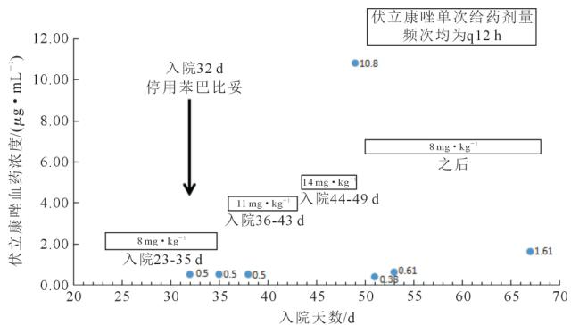

# 1 例基于治疗药物监测干预伏立康唑药物相互作用分析

冯静1，程东良2，史长松2，赵淑娟1，马培志1 （河南省人民医院 ，1．药学部 ，2．儿童重症监护病房 ，河南 郑州450003）

［摘要］ ：伏立康唑是目前治疗侵袭性曲霉菌病的一线用药 ， 该药既是细胞色素 P450（cytochromeP450proteins，CYP）2C9、2C19、3A4的底物也是其抑制剂 ，临床上与许多药物存在相互作用 ；而且已有大量研究表明 基因多态性、性别、年龄等因素都会显著影响伏立康唑的血药浓度 ， 因此临床使用伏立康唑需要进行治疗药物监测 （therapeuticdrugmonitoring，TDM） 。 本文通过对1例曲霉菌中枢感染患儿应用伏立康唑的监测与干预 ，探讨临床药师基于治疗药物监测在识别药物相互作用中发挥的作用。

［关键词］ 治疗药物监测 ；药物相互作用 ；伏立康唑 ；苯巴比妥

［中图分类号］ R978．5 ［文献标识码］ A ［文章编号］1001－5213（2021）12－1269－03 DOI：10．13286／j．1001－5213．2021．12．20

Therapeuticdrugmonitoringandinterventionofvoriconazoledruginteraction：onecasereport

FENGJing1，CHENGDong－liang2，SHIChang－song2，ZHAOShu－juan1，MAPei－zhi1 （HenanProvincalPeo－ple’sHospital，1．DepartmentofPharmacy；2．PediatricIntensiveCareUnit，HenanZhengzhou450003，China）

伏立康唑是第2代三唑类抗真菌药 具有广谱抗真菌活性的作用 是目前治疗侵袭性曲霉菌病的一线用药 伏立康唑使用者个体间血药浓度差异较大 ， 这是由于该药在人体药动学特征呈非线性 ， 同时该药既是细胞色素 P450酶（cytochromeP450proteins，CYP）CYP2C9 CYP2C19 和CYP3A4的底物 也是其抑制剂 临床上与许多药物存在相互作用 。 因此 ，临床使用伏立康唑需要进行治疗药物监测 ，根据血药浓度调整给药剂量 实施个体化治疗 提高药物的疗效 ，避免或减少药物不良事件［1］ 本文对象是1例儿童中枢神经系统曲霉菌感染的病例 该患儿共住院4月余行伏立康唑治疗期间 ，疗效欠佳 ，遂请临床药师会诊 。 临床药师建议停用肝药酶诱导剂苯巴比妥 ， 后多次监测伏立康唑血药浓度并调整给药剂量 最终血药浓度达标 经过内外科处理 医生和药师的共同努力 该患儿预后较好 现报道如下

## 1 病例资料

患儿 男 6岁 体质量24kg 因“发热伴咳嗽2天 气喘 嗜睡1天”于2018年12月30日就诊于当地医院 血常规＋CRP 示 ： 白细胞 31．4×109／L 中 性 粒 细 胞 百 分 比90．2％ CRP55．01mg·L－1 胸部CT示双肺多发渗出 左肺上叶实变 左侧胸腔积液 ；患儿既往体健 给予呼吸支持 抗感染、激素、丙球等治疗。 2d后（2019年1月1日） 转入我院 ，初步诊断 ： （1） 重症肺炎并胸腔积液 ； （2） 多器官功能损害 ； （3）颅内感染？（4） 呼吸窘迫综合征？。 给予呼吸机辅助呼吸 亚胺培南西司他丁联合万古霉素抗细菌 帕拉米韦抗病毒 强心 利尿等对症支持治疗 入院第15天 （2019年1月15日）患儿双眼凝视 频繁眨眼 右上肢及下肢肌张力增高 四肢轻微抖动 脑电图提示异常脑电信号 考虑“继发性癫痫” 给予苯巴比妥 丙戊酸 左乙拉西坦抗癫痫治疗 ；查头颅磁共振平扫示 ：颅内多发对称异常信号影 ，获得性代谢性病变？感染性病变？右侧 枕 叶、额叶异常信号影 ， 感 染 性 病变？入院第16天（2019年1月16日）查血G／GM 实验均阳性 ，给予两性霉素B脂质体抗真菌治疗 ， 因抗感染疗效欠佳且痰培养示 ：鲍曼不动杆菌 ，换用敏感抗细菌药物头孢哌酮舒巴坦联合多粘菌素B治疗。 监测电解质血钾持续偏低 ，考虑为两性霉素B的不良反应 ，2019年1月23日换用伏立康唑（8mg·kg－1 q12hivgtt） 并给予补钾治疗 入院第28天复查头颅核磁提示脑脓肿形成 ，予 脑 脓 肿 穿 刺 引 流 术 ， 引 流物培养示烟曲霉生长 因伏立康唑治疗效果欠佳 入院第31天（2019年1月31日） 请临床药师会诊 临床药师查阅医嘱建议 ： （1）停用苯巴比妥注射液 ； （2）使用两性霉素B联合伏立康唑抗真菌治疗 （3）监测伏立康唑血药浓度 （4）监测肝肾功能 电解质 次日伏立康唑血药浓度结果示小于0．5 g·mL－1 低于目标谷浓度下线［1］ 且患儿病情不稳定仍间断抽搐 烦躁 阵发性抖动 发热 3d后复查伏立康唑血药浓度仍小 于0．5 μg·mL－1， 药师建议伏立康唑加量使用（11mg·kg－1，q12hivgtt） ， 再次复查伏立康唑血药浓度仍未达标 因伏立康唑主要经CYP2C19代谢 且已给予较大剂量 临床药师建议查患儿 基因型 其基因型显示 ＊ ＊ 系中等速度代谢者 苯巴比妥停用3d后监测其血药浓度为5．5 g·mL－1，因伏立康唑血药浓度多次复查均低于目标值 患儿 基因型非快代谢型 抗感染疗效差 ，2019年2月13日 按 文 献［2］支持的最大量给予0．35gq12h静脉注射 后（2019年2月18日）复查血药浓度10．8μg·mL－1。

患儿2019月2月19日转至北京儿童医院 继续给予两性霉素B联合伏立康唑抗真菌治疗 因伏立康唑血药浓度过高 ，监测肝肾功能未见异常 ， 入院当天仅给予1剂（8mg·kg－1） ，2019年2月20日复查伏立康唑血药浓度0．38 μg·mL－1，给予 $8 ~ \mathrm { m g } { \bullet } \mathrm { k g } ^ { - 1 }$ 、q12hivgtt维持 ，后多次复查伏立康唑血药浓度达标（图1）

因感染控制欠佳 ，于2019年3月31日行右枕叶脓肿切除并外引流术 术后继续原抗真菌方案治疗 患儿体温逐渐降至正常 ，复查G／GM 实验进行性下降 ，手术治疗对于感染灶的清除起到了更重要的作用。 2019年4月19日 停 用 两性霉素B注射液 ，2019年4月24日停用伏立康唑注射液 ，给予伏立康唑 片200mgq12h口 服 序 贯 （体 质 量22kg） 治疗。 患儿2019年5月1日 出 院 ， 院外规律监测伏立康唑血药浓度 G／GM 实验 肝功能 2020年7月再次随访 ， 家长诉患儿仍在康复训练中 ，走路慢 ，不太稳 ，其余状态可

scatterplot

| 入院天数/d | 伏立康唑血药浓度/(μg·mL⁻¹) |
| ---------- | -------------------------- |
| 32         | 0.5                        |
| 35         | 0.5                        |
| 36-43      | 0.5                        |
| 44-49      | 1.4                        |
| 45         | 1.08                       |
| 50         | 0.98                       |
| 53         | 0.61                       |
| 67         | 1.61                       |

图1 伏立康唑血药浓度监测结果及给药剂量  
Fig1 Monitoring results ofvoriconazole blood concentration anddose

## 2 讨论

2．1 患儿伏立康唑血药浓度不达标原因分析 伏立康唑使用者个体间血药浓度差异较大 且其血药浓度与临床疗效不良反应具有较好的相关性［3－6］ ，因此 ，指南推荐对接受伏立康唑治疗侵袭性曲霉菌病的患者 应常规进行治疗药物监测［7－8］ 患儿伏立康唑血药浓度多次监测不达标 ， 考虑与以下因素有关 ： （1）血药浓度监测时机是否合适（是否达药物稳态） （2）采血点是否正确（给药前30min采血） （3）CYP抑制剂和／或 CYP诱导剂的药物相互作用［9－10］ ； （4） 肝 药 酶CYP2C19的遗传多态性［11］ ； （5） 其他因素如年龄 肝功能等［12］ 与医生及护理人员沟通 采血时机合适 影响因素（1） 、 （2） 排 除。 下 面 主 要 讨 论 药 物 相 互 作 用 及 肝 药 酶CYP2C19的遗传多态性

2．1．1 代谢相关药物相互作用 伏立康唑通过细胞色素P450酶CYP2C19CYP2C9和 CYP3A4代谢 ， 但又是这几种酶的抑制剂 因此临床合用同种代谢酶的底物或酶诱导剂 抑制剂时也可能会对伏立康唑血药浓度产生影响［13］本患者按照说明书推荐剂量给药 监测血药浓度不达标临床药师查阅医嘱后发现患儿同时使用苯巴比妥注射液苯巴比妥为长效巴比妥类药物 是典型的肝药酶CYP2C和3A4诱导剂 会诱导细胞色素P450酶 与同时经肝药酶代谢的伏立康唑联用可能增加伏立康唑的代谢 导致血浆浓度的降低 故不推荐合用［8］ 临床药师遂建议停用苯巴比妥并监测苯巴比妥 伏立康唑血药浓度 苯巴比妥血药浓度为 $5 . \ 5 \ \mu \mathrm { g } \cdot \mathrm { m L } ^ { - 1 }$ （参考值 $1 5 \sim 4 0 ~ \mu \mathrm { g } \bullet \mathrm { m L } ^ { - 1 [ 1 4 ] }$ ） ， 伏立康唑血药浓度小于 $0 . \mathrm { ~ 5 ~ } \mu \mathrm { g } \cdot \mathrm { m L } ^ { - 1 }$ ，增加伏立康唑剂量 ，再次 复查其血药浓度仍小于 $0 . \mathrm { ~ 5 ~ } \mu \mathrm { g } \cdot \mathrm { m L } ^ { - 1 }$ ， 临床药师再次查阅相关文献 ，苯巴比妥及其它长效巴比妥类药物对肝酶诱导 的起止时间尚不明确 而且很可能表现出患者间和药物间的巨大差异 相关个案研究显示苯巴比妥停药约13d， 苯巴比妥浓度检测不到后6d 伏立康唑血药浓度才随酶诱导的抵消而升高［15］ 有关于 CYP450诱导剂联合使用对伏立康唑药动学影响的系统评价里提到酶诱导剂产生最大诱导效应的时间相对较 长 ， 受限于酶的生成速度 ， 需 要2～3周甚至更长 ；当酶诱导剂停用后 ， 酶水平回落到基线水平的时间也取决于酶衰减的时间 ， 其比抑制剂停用后酶水平 回升到基线水平所需的时间长 ， 一 般 需 要 2～3周［16］ 。 这 就可以解释虽然苯巴比妥血药浓度很低 而伏立康唑血药浓度仍不达标 ，即苯巴比妥的肝药酶诱导作用并没有随着药物停用而立即消失 可能这种作用会持续一段时间 后再次增加伏立康唑剂量至最大量 ，苯巴比妥停药17d监测伏立康唑血药浓度过高 ， 即苯巴比妥诱导作用消失 ， 伏立康唑可降至常规剂量 后多次监测 血药浓度多达标

2．1．2 肝药酶CYP2C19的遗传多态性 伏立康唑主要通过肝细胞色素P450同工酶 CYP2C19CYP2C9和 CYP3A4代谢 ，同时也是这 3种酶的抑制剂［9］ 。 其中 CYP2C19是伏立康唑主要的代谢途径［10］ 根据 基因型的不同酶活性强弱不同 ，可以将个体分为超快代谢型 快代谢型 正常代谢型 中间代谢型及慢代谢型［12］ 因此 基因多态性是造成伏立康唑个体差异大的另一个重要影响因素 约49％的个体差异可以用 基因变异解释［4］ 检测该患儿 基因型系中等速度代谢者 根据临床药物基因组学实施联盟（CPIC）对 不同基因型使用伏立康唑治疗指南［12］ 针对儿科患者的 基因型给出的伏立康唑的剂量建议 ，对于儿童中间代谢型与正常代谢型相比 ，伏立康唑谷浓度高 ，应以推荐的标准剂量开始治疗 此患儿目前的使用剂量已经远远超过推荐的标准剂量 ，药师考虑其血药浓度不达标可能与其它因素有关

2．2 伏立康唑相互作用的替代方案 在肝药酶诱导剂导致的伏立康唑血药浓度不达标时可以使用其他无药物相互作用的抗真菌药物 如两性霉素B来连接治疗 直到肝酶诱导作用下降并消失 ；或通过血药浓度监测增加给药剂量 本病例给予两性霉素B联合抗感染 ，在血药浓度不达标时亦通过增加给药剂量以达到抗感染疗效 ，并多次监测血药浓度 ； 在肝药酶诱导作用消失后及时降低给药剂量 ，以免伏立康唑血药浓度过高 导致严重不良反应的发生

## 3 小结

伏立康唑为治疗侵袭性曲霉感染的一线药物 ，但因其在肝脏代谢 ，其血药浓度影响因素较多 ，药师应从专业角度关注药物相互作用、基因多态性等 ，为临床医生提供用药建议。通过医嘱审核发现药物不良相互作用 并通过伏立康唑血药浓度监测指导个体化治疗是一种适当的方法 临床药师及医生要关注肝药酶诱导剂的药物相互作用及其影响时间 根据血药浓度调整给药剂量

## 参考文献 ：

［1］ LinZQ，ZhangQQ，ChenTT．Therapeuticdrugmonitoringofvoriconazole：anoverviewofrelevantguidelinesathomeanda－broad［J］．ADRJ（药物不良反应杂志） ，2020，22（7） ：409－415  
［2］ CarolK．Taketomo， Jane H．Hodding， Donna M．Kraus．Pedlatric＆Neonataldosagehandbook［ M］．Vol23．UnitedStates：LIMS2016：1888  
［3］ WeissJ，TenHoevelMM，BurhenneJ， ．CYP2C19geno－typeisamajorfactorcontributingtothehighlyvariablephar－macokineticsofvoriconazole［J］．JClinPharmacol，2009，49（2） 196－204  
［4］ AllegraS，FatigusoG，DeFranciaS， ．Therapeuticdrugmonitoringofvoriconazolefortreatmentandprophylaxisofin－vasivefungalinfectioninchildren［J］．BrJClinPharmacol，201884（1） 197－203  
［5］ TrokePF，HockeyHP，HopeWW．Observationalstudyoftheclinicalefficacyofvoriconazoleanditsrelationshiptoplasmaconcentrationsinpatients［J］．AntimicrobAgentsChemother，201155（10） 4782－4788  
［6］ YuSY，WangFengZP．Applicationofvoriconazoletroughcon－centrationmonitoringinthetreatmentofinvasivefungalinfec－tions［J］．PharmacyToday（今日药学） 201727（5） ：326－330  
［7］ PattersonTF，ThompsonGR3rd，DenningDW， ．PracticeGuidelinesfortheDiagnosisandManagementofAspergillosis：2016UpdatebytheInfectiousDiseasesSocietyofAmerica［J］ClinicalInfectiousDiseases，2016，63（4） ：e1－60  
［8］ ChenK ZhangX KeX ．Individualizedmedicationofvoriconazole：apracticeguidelineofthedivisionoftherapeuticdrugmonitoring， Chinesepharmacologicalsociety［J］．TherDrugMonit，2018，40（6） ：663－674  
［9］ DoltonMJ， MikusG， WeissJ， ．Understandingvariability  
with voriconazole using a population pharmacokinetic ap－proach：implicationsforoptimaldosing［J］．JAntimicrobChe－mother201469（6） ：1633－1641  
［10］ DoltonMJ，McLachlanAJ．Optimizingazoleantifungaltherapyintheprophylaxisandtreatmentoffungalinfections［J］．CurrOpinInfectDis，2014，27（6） ：493－500  
［11］ Gautier－VeyretE，FonroseX， ToniniJ， ．Variabilityofvoriconazoleplasmaconcentrationsafterallogeneichematopoi－eticstemcelltransplantation：impactofcytochromeP450poly－morphismsandcomedicationsoninitialandsubsequenttroughlevels［J］．Antimicrob Agents Chemother， 2015， 59 （4） ：2305－2314  
［12］ MoriyamaB，ObengAO，BarbarinoJ， ．Clinicalpharmaco－geneticsimplementation consortium （ CPIC） guidelinesforCYP2C19andvoriconazoletherapy［J］．ClinPharmacolTher，2017102（1） ：45－51  
［13］ ZhangJJ Lv WW WeiCM．Influencefactorsofindividualdifferencesinclinicalapplicationofvoriconazole［J］．ChinJHospPharm （中国医院药学杂志） ，2016，36（14） ：1220－1224  
［14］ LiSC，HongZ， WuX， ．ClinicalDiagnosisandTreatmentGuidelinesforEpilepsy［M］．Vol2．Beijing：People’sMedicalPublishingHouse，2015：39  
［15］ MillerAD KentME CookAM ．Managementofavori－conazole－phenobarbitaldruginteractionusingvoriconazolecon－centrationmonitoring［J］．InfectiousDiseasesinClinicalPrac－tice200917（3） 181－183．2009  
［16］ T－y．Li， W．Liu，K．Chen， ．TheinfluenceofcombinationuseofCYP450inducersonthepharmacokineticsofvoricon－azole：asystematicreview［J］．JClinPharm Therap，2017，42（2） 135146

［收稿日期］2021－0110

## （ 上接第 1 2 7 7 页 ）

［8］ CukerA，ArepallyGM，ChongBH， ．AmericanSocietyofHematology2018guidelinesformanagementofvenousthrom－boembolism： heparin－induced thrombocytopenia ［J］．BloodAdv，2018，2（22） ：3360－3392  
［9］ ChineseExpertAdviceWritingGrouponPreventionofVenous ThromboembolisminInternalMedicineInpatients，Respiratory BranchofChinese MedicalAssociation GeriatricsBranchof

ChineseMedicalAssociation， ．Chineseexperts’ adviceonpreventionofvenousthromboembolismininternalmedicinein－patients［J］．ChinJTubercRespirDis（中华结核和呼吸杂志）201538（7） 484491

［10］ WangL DengX．Miningandanalysisoftocilizumabadversereactionsignalsbaseduponrealworld［J］．ChinJHospPharm（中国医院药学杂志） 202141（5） ：533－537552

［收稿日期］2020－12－20