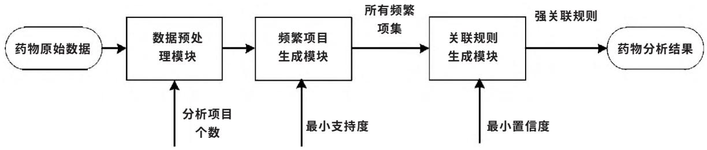
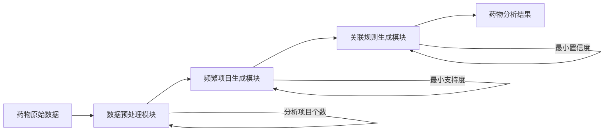

文章编号 ： 1674 － 2869 （ 20 15 ） 10 － 0057 － 04

# FP－ Growth 算法在药物相互作用系统中的应用

王 殿 君 1 ， 2 邵 宗 凯 1\*

1.昆明理工大学信息工程与自动化学院 云南 昆明 650500

2．云南省第一人民医院云南省药学服务质量管理研究中心 云南 昆明 650500

摘 要 针对联合用药多不良反应事件频发的问题 提出使用关联规则挖掘中的 FP－Gr th 算法进行分析运算. 通过 FP－Gr th 算法挖掘药物相互作用数据 得出了药物相互作用的规则 并将此算法成功运用到系统中. 通过对数据库中的药物数据进行分析 对药物是否可以联合用药做出判断 进而对配药工作提供决策支持. 设计并实现了静脉注射药物相互作用分析系统. 结果表明 系统可以提高药物相互作用数据查询的速度 95％左右 有利于促进合理用药和用药安全.

关键词 ： 药物 ； 关联规则 ； FP－Growth ； 相互作用

中国法分类号 TP31 1 1

文献标识码 ：A

doi ： 10. 3969/j. issn. 1674-2869. 2015. 10. 011

## 0 引 言

如今 伴随着静脉药物治疗中药品种类的不断增加以及新品种药物的出现 联合用药得到了广泛使用 同时所产生的药物之间相互作用也受到了人们越来越多的关注. 目前 在静脉用药当中 对病人进行治疗的过程中几乎不存在一次只使用单一种类药物的情况 联合用药是为了增强药物的治疗效果 同时又减少药物的不良反应和用药量 随着当前联合用药数量越来越多 药物之间的不良反应的频率也在不断的上升 联合给药中药物相互作用是导致药物不良反应的一个非常重要的因素. 因此 对药物相互作用的研究具有重要的指导意义和实践意义［1－2］. 数据挖掘是最近几年里发展起来的一种信息处理技术 它是通过相关的算法搜索出隐藏于其中有价值信息的过程. 本文对关联规则挖掘中的 FP－Growth 算法进行了有关研究 利用的药物数据是相关文献［3－4］中的抗感染类药物数据 探讨各药物之间潜在 有价值的关系.

## 1 药物相互作用的相关概念

药物相互作用是指在相同的时间或同一段时间 2 种或 2 种以上的药物联合使用时所导致药物疗效所产生的变化 可能加强疗效或减少药物的不利影响 也可能是药物的药效减弱或者出现本来不应该有的副作用 有时候甚至可能发生一些罕见的不良反应 进而危害患者的身体健康［1］. 比如：当去甲肾上腺素与全麻药同时使用时 会使心肌对拟交感胺类药反应更加的敏感 容易发生室性心律失常不适宜一同使用 必须一同使用时应减少用量 ；当甲苯磺丁脲与磺胺类药物同时使用时 会致使人体出现低血糖的症状.

## 2 数据挖掘概述

## 2 1 数据挖掘概念

在最近几十年中 伴随着计算机 数据库及其相关技术的快速发展的同时 数据的存储也变的越来越简单和低廉. 如何对数据进行处理成为我们必须面对的问题 所以数据挖掘技术应运而生 数据挖掘是指从海量的数据中发现潜在的 有用的最终可转换成可被理解的形式的过程. 受多个学科影响 比如 ：统计学 数据库 机器学习 信息科学 可视化和其它学科等［5－6］.

## 2.2 关联规则概念

当前在医药学领域中数据挖掘技术应用也十分广泛与成功［7］. 将数据挖掘中的关联规则应用到医院静脉注射药物相互作用分析中 促进了合理用药 从而对静配中心的药物分析工作起到一定的指导作用.

关联规则挖掘用来找出海量数据中各项集之间潜在的相关联系 它是数据挖据中的一类重要算法. 最近几年广泛应用于各个行业中.

FP－Growth 算法 ［8－9］ 作为关联规则挖掘中的经典算法 FP－Growth 算法利用了特殊的数据结构解决了 APRIORI 算法挖掘过程中需要不断扫描数据库的缺点 它不需要不断的生成候选项集和不断的扫描数据库来进行对比 为了能够达到这种效果 它采用了一种特殊的数据结构形式 称为频繁模式树 （ FP－tree ） .

采用 FP－Growth 算法的步骤如下

（1）为每一个频繁项 ， 构建它的条件模式基 ，然后再构建它的条件频繁模式树．  
（2） 为每个新创建的条件频繁模式树重复上述过程．  
（3）当构建的频繁模式树为 NULL 时 它的前缀就是频繁模式 ；当频繁模式树只包含 1 条路径时 ，列出所有可能的组合 ， 然后与 FP－tree 的前缀连结就可以获取频繁模式.

通过最小置信度对每个频繁项集进行筛选选出置信度大于或等于最小置信度的频繁项集形成强关联规则 成为有效关联规则

## 3 以关联规则挖掘开发的静脉注射药物相互作用的分析系统

静脉药物配置中心 简称静配中心 英文缩写为 PIVAS 是指依照国际标准的要求和药物的特点来设计配药环境 并由接受过严格训练的药学技术人员来依照操作流程对包括细胞毒性药物在内的一些药物进行集中科学配置的医药机构［10］ 它是为合理用药和临床治疗服务的 静脉药物配置中心可为临床治疗提供安全、可靠、经济的静脉用药 对临床治疗中的合理用药起到重要的促进作用所以将数据挖掘中的关联规则算法应用到医院静配中心静脉注射药物相互作用中有非常重要的实际和指导意义

药物相互作用的关联规则挖掘流程图如图 1所示.

flowchart

图 1 药物相互作用分析关联规则流程图  
Fig．1 Flowchart of association rules of drug interaction analysis

## 3．1 数据处理

数据处理过程可以用来改善数据的质量 从而有利于后续的数据挖掘工作 提供高质量的数据从而提高了数据挖掘的准确度和性能 本文主要对《药物相互作用基础与临床》和《静脉用药物调配技术》两本书中的抗感染类药物分别为 41 种137 种药物数据进行处理

根据以上的药物数据 将相关文献中的抗感染类药物信息进行数据处理 以此建立药物事务的数据库表 此事务数据库表包括七个栏目 ： 审核项目 药物名称 异常药物名称 提示 异常药物编码 异常药物类别和注意事项描述 其中提示信息可以分为：

1）禁止与其配伍；  
2）与其配伍需谨慎  
3）需要关注  
4）调低用药剂量；  
5）调高用药剂量

## 3．2 关联规则挖掘结果及分析

通过多次试验 最终将最小置信度设为40％而避免合用药物最小支持度设为 8％ 谨慎合用药物最小支持度设为 10％ 可以合用药物数据库的最小支持度设为 10％［11］

对产生的关联规则作分析 从而得出其中的一些规律 取其中的几条强关联规则进行说明.

由避免合用药物生成规则说明与庆大霉素需避免合用的抗感染类药物有 92．5％与卡那霉素也需避免合用

庆大霉素圯卡那霉素 0．925

这条规则的置信度为 92．5％ 说明 ：当有一种抗感染类药物与庆大霉素避免合用时 这种药物同时与卡那霉素避免合用的概率为 92．5％.

由谨慎合用药物生成规则说明与妥布霉素需谨慎合用的抗感染类药物有 41．4％与多黏菌素 B与需谨慎合用

妥布霉素圯多黏菌素 B 0．414

这条规则的置信度为 41．4％，说明 ：当有一种抗感染类药物与妥布霉素谨慎合用时，这种药物同时与多黏菌素 B 谨慎合用的概率为 41．4％.

对于其它规则也可以得到同样的结果. 由可以合用药物生成规则：

阿苯达唑圯氯喹＋伏立康唑 0．50

这条规则的置信度为 50％，说明当有一种抗感染类药物与阿苯达唑可以合用时 这种药物同时与氯喹和福利康唑可以合用的概率为 50％.

将关联规则应用到静脉注射药物相互作用分析中 系统经过一段时间实际测试 效果良好 部分结果显示结果如图 2 所示.

<table><tr><td colspan="10">相互作用查询</td></tr><tr><td colspan="10">查看表单</td></tr><tr><td colspan="10">相互作用查询条件</td></tr><tr><td>搜索选项</td><td>查询</td><td colspan="8">清空条件</td></tr><tr><td>药物名称:</td><td></td><td></td><td></td><td></td><td>剂量调整:</td><td>全部</td><td></td><td>药房:</td><td>静脉用药配置中心</td></tr><tr><td colspan="10">Drag a column header and drop it here to group by that column.</td></tr><tr><td>审核项目</td><td>药物名称</td><td>异常药物名称</td><td>提示</td><td>异常药物规格</td><td>异常药物编码</td><td>异常药物类别</td><td>注意事项描述</td><td></td><td></td></tr><tr><td>药物药物相互作用</td><td>氨曲南</td><td></td><td>调高用药剂量</td><td></td><td></td><td>氨基糖苷类</td><td></td><td></td><td></td></tr><tr><td>药物药物相互作用</td><td>氨曲南</td><td>头孢西丁</td><td>调低用药剂量</td><td></td><td>逻辑药物</td><td></td><td></td><td></td><td></td></tr><tr><td>药物药物相互作用</td><td>氨溴索</td><td></td><td>调高用药剂量</td><td></td><td></td><td>其他抗菌抗生素</td><td></td><td></td><td></td></tr><tr><td>药物药物相互作用</td><td>胺碘酮</td><td>环孢素</td><td>调低用药剂量</td><td></td><td>逻辑药物</td><td></td><td></td><td></td><td></td></tr><tr><td>药物药物相互作用</td><td>胺碘酮</td><td>地尔硫卓盐酸盐</td><td>需要关注</td><td>30mg*40片/盒</td><td>Y00000010911</td><td></td><td></td><td></td><td></td></tr><tr><td>药物药物相互作用</td><td>昂丹司琼</td><td>地塞米松</td><td>调高用药剂量</td><td>1ml:5mg*1支/支</td><td>Y00000010527</td><td></td><td></td><td></td><td></td></tr><tr><td>药物药物相互作用</td><td>奥美拉唑</td><td>地西泮</td><td>调低用药剂量</td><td></td><td>逻辑药物</td><td></td><td></td><td></td><td></td></tr><tr><td>药物药物相互作用</td><td>奥美拉唑</td><td>地西泮</td><td>调低用药剂量</td><td></td><td>逻辑药物</td><td></td><td></td><td></td><td></td></tr><tr><td>药物药物相互作用</td><td>奥美拉唑</td><td>复方酮康唑</td><td>调高用药剂量</td><td>20g*1支/支</td><td>Y00000011024</td><td></td><td></td><td></td><td></td></tr><tr><td>药物药物相互作用</td><td>奥美拉唑</td><td>华法林</td><td>调低用药剂量</td><td></td><td>逻辑药物</td><td></td><td></td><td></td><td></td></tr><tr><td>药物药物相互作用</td><td>奥美拉唑</td><td>华法林</td><td>调低用药剂量</td><td></td><td>逻辑药物</td><td></td><td></td><td></td><td></td></tr><tr><td>药物药物相互作用</td><td>奥美拉唑</td><td>华法林</td><td>调低用药剂量</td><td></td><td>逻辑药物</td><td></td><td></td><td></td><td></td></tr><tr><td>药物药物相互作用</td><td>奥美拉唑</td><td>伊曲康唑</td><td>调高用药剂量</td><td></td><td>逻辑药物</td><td></td><td></td><td></td><td></td></tr><tr><td>药物药物相互作用</td><td>奥美拉唑</td><td>克拉霉素</td><td>调低用药剂量</td><td>125mg*6片/盒</td><td>Y00000010942</td><td></td><td></td><td></td><td></td></tr><tr><td>药物药物相互作用</td><td>奥美拉唑</td><td>克拉霉素</td><td>调低用药剂量</td><td>125mg*6片/盒</td><td>Y00000010942</td><td></td><td></td><td></td><td></td></tr><tr><td>药物药物相互作用</td><td>奥美拉唑</td><td>苯妥英钠</td><td>调低用药剂量</td><td></td><td>逻辑药物</td><td></td><td></td><td></td><td></td></tr><tr><td>药物药物相互作用</td><td>奥美拉唑</td><td>苯妥英钠</td><td>调低用药剂量</td><td></td><td>逻辑药物</td><td></td><td></td><td></td><td></td></tr></table>

图 2 关联规则在静配中心药物相互作用系统中的应用  
Fig．2 Application of association rules in drug－interaction system at the center of the static distribution

## 4 结 语

结合以上分析 对于药物的相互作用案例进行关联规则挖掘是可行的 通过设置合理的最小置信度和支持度阈值能够挖掘出有意义的规则. 通过分析这些强关联规则集有利于揭示数据之间潜在的 有价值的联系

对关联规则挖掘中的 FP－Growth 算法进行了相关研究 并对药物数据进行了挖掘 初步探讨了各个药物各因素值间的联系 实际并实现了静脉注射药物相互作用分析系统 促进了合理用药和用药安全

## 致 谢

感谢昆明理工大学信息工程与自动化学院云南省第一人民医院药剂科静配中心提供的帮助与支持！

## 参考文献 ：

［1］ 刘彦卿 洪燕君 曾苏．代谢性药物－药物相互作用的研 究 进 展 ［ J ］ ．浙 江 大 学 学 报 （ 医 学 版 ） 2009 38 （2 ） ：215－224．  
LIU Yan－qing HONG Yan－jun ZENG Su． Recent ad-vances in metabolism－based drug－drug interactions ［ J ］ ．Journal of Zhejiang University （ Medical Sciences ）2009 38 （2 ） ： 215－224． （in Chinese ）  
［2］ 孟威宏 史国兵 赵庆春 等．促进医疗机构合理用药的对策 ［ J ］ ．中国药房 2011 22 （5 ） 385－387．  
MENG Wei－hong ， SHI Guo－Bing ， ZHAO Qing－chun ，et al． Countermeasures for the Improvement of RationalDrug Use in Medical Institutions ［ J ］ ． China Pharmacy ，2011 22 （5 ） ： 385－387． （in Chinese ）  
［3］ 刘治军 韩红蕾．药物相互作用基础与临床［M］．北京人民卫生出版社 2009．  
LIU Zhi－jun HAN Hong－lei． Basic and clinical drug  
interaction ［ M ］ ． Beijing ： People＇s Medical PublishingHouse （PMPH ） 2009． （in Chinese ）  
［4］ 刘圣 傅先明．静脉用药物调配技术［M］．安徽 ：安徽科学技术出版社 2015．  
LIU Sheng ， FU Xian－ming．Intravenous Drug formulationtechnology ［ M ］ ．Anhui ： Anhui Science and TechnologyPress ， 2015． （ in Chinese ）  
［ 5 ］ TAN Pang－ning ， Michael Steinbach ， Vipin Kumar． In-troduction to Data Mining ［ M ］ ． Addison Wesley ： 1stInternational edition 2005．  
［6］ 王光宏 ，蒋平．数据挖掘综述 ［J］．同济大学学报（自然科学版 ） 2004 32 （2 ） ： 246－252．  
WANG Guang－hong JIANG Ping． Survey of data min-ing ［ J ］ ． Journal of Tongji University （ Natural Science ）2004 32 （2 ） ： 246－252． （in Chinese ）  
［7］ 刘婵桢 王友俊．医学数据挖掘技术与应用研究［J］．生物医学工程学杂志 2014 31 （5 ） ： 1182－1186．  
LIU Chan－zhen WANG You－jun． Research on medi-cal data mining and its applications ［ J ］ ． Journal ofBiomedical Engineering ， 2004 ， 31 （ 5 ） ： 1182－1186． （ inChinese ）  
［8］ 陆楠 王喆 周春光． 基于 FP－tree 频集模式的 FP－  
Growth 算法对关联规则挖掘的影响 ［J］．吉林大学学报 （ 理学版 ） 2003 41 （2 ） ： 180－185．  
LU Nan ， WANG Zhe ， ZHOU Chun－guang． The effectof fp －growth algorithm based on fp －tree frequent setpatterns on association rule mining ［ J ］ ． Journal of JilinUniversity （ Science Edition ） 2003 41 （ 2 ） ： 180－185．（ in Chinese ）  
［ 9 ］ Jiawei Han ， Micheline Kamber． Data Mining Conceptsand Techniques ［M ］． Beijing ： China Machine Press ，2001．  
［10］ 晏马成 陈胜新 周东．医院静脉注射液配制业务 的进展 ［ J ］ ．中国医院药学杂志 2003 23 （8 ） ： 29－34．  
YAN Ma －cheng ， CHEN Sheng －xin ， ZHOU Dong．Hospital intravenous injection allocation of businessprogress ［ J ］ ． Chinese Journal of Hospital Pharmacy ，2003 23 （8 ） ： 29－34． （in Chinese ）  
［11］ 胡双． 关联规则挖掘研究及其在药物相互作用中的应用［D］． 昆明 昆明理工大学 2013．  
HU Shuang． Mining association rules and its application in the drug interaction ［ D ］ ． Kunming ： Kunming University of Science and Technology 2013． （ in Chinese ）

# Application of FP－Growth algorithm in interacting system of medicine

WANG Dian－jun1，2 SHAO Zong－kai\*1

1 .Faculty of Information Engineering and Automation ， Kunming University of Science and Technology ， Kunming 650500 ，China ； 2．Research Center for Pharmaceutical Care and Quality Management ， the First People＇s Hospital of Yunnan Province ，Kunming 650500 ， China

Abstract ： Aimed at the adverse drug reactions resulted from the combination of drugs ， the FP － Growth in association rules mining was proposed． The drug－interaction rules were obtained by using FP－Growth algorithm to mine the data of drug interaction ， and the algorithm was applied to the system successfully． By analyzing the drug data in the database the feasibility of the drug combination could be concluded which could provide decision support for the work of configuring drugs． Finally ， the system of intravenous drug－interaction analysis system was designed． The application results show that the query speed of drug－interaction data increases by 95％ in the system ， which is conducive to rational drug use and medication safety．

Keywords ： drugs ； association rules ； FP－Growth ； interaction

本文编辑 陈小平