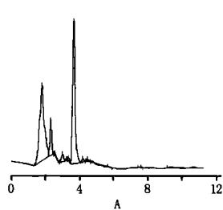
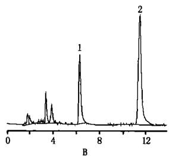
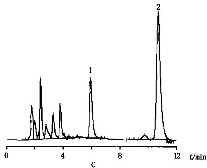
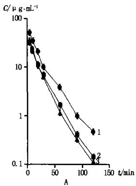
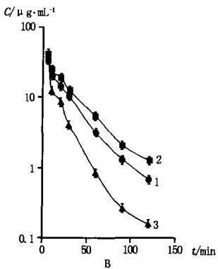

# HPLC 法测定大鼠血浆中咪达唑仑的含量及其在药物相互作用研究中的应用\*

赵娜萍,余露山,曾苏\*\*

(浙江大学药学院药物分析与药物代谢研究室, 杭州 310031)

摘要 目的:建立高效液相色谱法测定大鼠血浆中咪达唑仑含量,并应用于佐米曲坦对大鼠肝细胞中 CYP3A 的诱导作用的研究。方法:采用色谱柱为 $\text{Diamonsil}^{\text{TM}}(\text{钻石})\text{C}_{18}(200\ \text{mm} \times 4.6\ \text{mm}, 5\ \mu\text{m})$ , 流动相为乙腈 -0.01 mol·L $^{-1}$ 磷酸二氢钾缓冲液 (pH 5.0)(58:42), 流速为 1.0 mL·min $^{-1}$ , 检测波长为 220 nm。咪达唑仑 (10 mg·kg $^{-1}$ ) 作为经典 CYP3A 探针底物对 3 组不同诱导后的大鼠(佐米曲坦样品组、地塞米松阳性对照组或空白对照组)静注给药, 测定咪达唑仑的清除率等参数来研究 CYP3A 活性的变化。结果:咪达唑仑在 0.3 \~ 375 μmol·L $^{-1}$ 浓度范围内呈良好的线性关系 (r = 0.9997, n = 5), 检测限为 0.0018 μmol·L $^{-1}$ , 平均回收率为 97.9%。经佐米曲坦诱导的雄性大鼠组中咪达唑仑 AUC $_{0-t}$ 和 $T_{1/2}$ 与雄性空白大鼠组中咪达唑仑 AUC $_{0-t}$ 和 $T_{1/2}$ 比, 显著降低, 清除率增加, 与地塞米松组中咪达唑仑的动力学参数相近; 而经佐米曲坦诱导的雌性大鼠的动力学参数与空白雌性组比没有明显的变化。结论:本文建立的大鼠血浆中咪达唑仑测定方法稳定、准确、简便, 能使咪达唑仑作为探针药物很好地运用于佐米曲坦对大鼠肝中 CYP3A 诱导作用研究中。另外佐米曲坦对大鼠肝中 CYP3A 具有性别差异的诱导作用。

关键词: HPLC; 咪达唑仑; 佐米曲坦; 诱导; CYP3A

中图分类号：R917

文献标识码：A

文章编号:0254-1793(2007)06-0821-04

# HPLC determination of midazolam in rat plasma and applied to investigation the drug interaction\*

ZHAO Na - ping, YU Lu - shan, ZENG Su \*\*

(Department of Pharmaceutical Analysis and Drug Metabolism, College of Pharmaceutical Sciences, Zhejiang University, Hangzhou 310031, China)

Abstract Objective: To develop an RP-HPLC method for the determination of midazolam in rats plasma. And the method was applied to investigate the induction effect of zolmitriptan on rat hepatic CYP3A activity in vivo. Method: HPLC for midazolam: The analytical column was $\mathrm{Diamonsil}^{\mathrm{TM}}\mathrm{C}_{18}$ (200 mm × 4.6 mm, 5 μm), the mobile phase consisted of acetonitrile - 0.01 mol · L $^{-1}$ potassium dihydrogen phosphate buffer solution (pH 5.0) (58: 42), the flow rate was 1.0 mL · min $^{-1}$ , and detected at 220 nm. Male and female SD-rats treated with zolmitriptan, dexamethasone and placebo (blank control) separately. And then animals received a single injection of midazolam (10 mg · kg $^{-1}$ ) in the tail vein after the last dose of zolmitriptan, dexamethasone or placebo. The midazolam pharmacokinetics of zolmitriptan group, dexamethasone group and blank control were compared. Results: The standard curves for midazolam were linear in the range of 0.3 - 375 μmol · L $^{-1}$ , $r = 0.9997$ , and the detection concentration of midazolam was 0.0018 μmol · L $^{-1}$ . The average recovery of midazolam was 97.9%. The area under the curve (AUC $_{0-t}$ ) and the elimination half-life of midazolam was significantly reduced in male rats by the zolmitriptan and dexamethasone pretreatment. While in female rats there were no significantly changes. Conclusion: The method is stable, accurate and simple, and can be used for investigation the effect of zolmitriptan on CYP3A activity in rats. Zolmitriptan has the gender-different effect of induction on male rat hepatic CYP3A activity.

Key words: HPLC; midazolam; zolmitriptan; induction; CYP3A

咪达唑仑(midazolam)是一个咪唑苯并二氮䓬类药物，咪达唑仑主要由CYP3A同工酶代谢。因为咪达唑仑的肝脏萃取率较低(约为0.34)，其清除率主要取决于CYP3A活性，而不依赖于肝血流量[1]。因此许多CYP3A的抑制剂能增加咪达唑仑的血药浓度延长其半衰期。另外咪达唑仑可以口服或静注方式安全给药，因此经常被用作体内CYP3A活性测定的经典探针底物[2]。咪达唑仑的高效液相色谱测定方法[3]曾有报道过，本文对以往的方法进行改进，使之能被更快速准确地测定，并且用咪达唑仑作为CYP3A的探针药物在大鼠体内研究佐米曲坦(zolmitriptan)对肝内CYP3A酶活性的诱导作用，应用CYP3A的经典诱导剂地塞米松(dexamethasone)作为阳性对照组的诱导剂。细胞色素P450(cytochrome P450,CYP450)是一组主要存在于肝脏和小肠中，结构和功能相关的超家族基因编码的同工酶，药物相互作用、致癌化合物的体内激活与失活等都与CYP活性有着密切关系。其中，CYP3A在药物及内源性物质的代谢中起非常重要的作用，很多药物和内源性物质都是其底物[4,5]。CYP3A可以被糖皮质激素（地塞米松）、有机氯杀虫剂（甲氧氯）和其他药物（苯妥英，利福平，乙醇等）诱导。

## 1 仪器与试药

岛津 LC-10A 高效液相色谱仪 (Shimadzu, 日本); 咪达唑仑 (纯度大于 99.5%) 购于浙江省三门县康宁化工有限公司, 内标地非三唑由浙江仙琚制药厂提供, 佐米曲坦对照品由浙江大学理学院化学系提供 (HPLC 法测得纯度大于 98%), 地塞米松为美国 Sigma 公司产品, 其他试剂均为国产分析纯。

## 2 方法

2.1 色谱条件 色谱柱: $\text{Diamonsil}^{\text{TM}}$ (钻石) $C_{18}$ (200 mm × 4.6 mm, 5 μm); 流动相: 乙腈 - 0.01 mol · L $^{-1}$ 磷酸二氢钾缓冲液 (pH 5.0) (58:42),; 进样量 20 μL; 流速: 1.0 mL · min $^{-1}$ ; 检测波长: 220 nm, 柱温: 30 ℃。  
2.2 对照品溶液以及内标储备液的配制 分别称取一定量的咪达唑仑对照品以及地非三唑，用甲醇溶解，制成浓度分别为 $3.62 \mu g \cdot mL^{-1}$ 和 $2.79 \mu g \cdot mL^{-1}$ 的溶液，作为对照品储备液和内标储备液。咪达唑仑对照品储备液用甲醇配制成系列浓度为 1.10, 2.70, 5.40, 27.10, 108.6, 271.5, 543.0, 1357.5 $\mu g \cdot mL^{-1}$ 的溶液作为对照品溶液。均置 $4^{\circ}C$ 保存。  
2.3 佐米曲坦对大鼠的诱导处理 Sprague-Dawley 大鼠(SD 大鼠),体重 200\~230 g,由浙江省中医

学院动物房提供(从中科院上海实验动物中心引进)。SD大鼠分为雌雄2批,每批3组,每组5只。其中3组分别为:佐米曲坦灌胃处理3 d组(雄性25.0 mg·kg $^{-1}$ 和雌性50.0 mg·kg $^{-1}$ );地塞米松100 mg·kg $^{-1}$ 灌胃处理3 d组;空白组生理盐水灌胃处理。

2.4 探针药物大鼠体内代谢试验 动物末次灌胃给药 8 h 后开始禁食, 禁食 16 h 后, 按 $10 \, mg \cdot kg^{-1}$ 的剂量尾静脉注射浓度为 $1 \, mg \cdot mL^{-1}$ 的咪达唑仑。然后分别在注射药物后 5, 10, 20, 30, 60, 90, 120 min 时尾静脉取血 0.5 mL 左右, 动物颈椎脱臼处死。  
2.5 样品处理 血样置肝素预处理的离心管中， $3000\mathrm{r}\cdot \mathrm{min}^{-1}$ 离心 $10\mathrm{min}$ ，分离出上层血浆。另取干净离心管加入 $0.15\mathrm{mg}\cdot \mathrm{mL}^{-1}$ 地非三唑甲醇溶液 $15\mu \mathrm{L}$ 作为内标，挥干甲醇溶剂，加入血浆样品 $0.1\mathrm{mL}$ ，再加乙酸乙酯 $1\mathrm{mL}$ 进行提取，旋涡混合 $3\mathrm{min}, 13000\mathrm{r}\cdot \mathrm{min}^{-1}$ 离心 $5\mathrm{min}$ ，取上层有机溶剂 $0.9\mathrm{mL}$ ，真空抽干，流动相 $50~\mu \mathrm{L}$ 溶解残渣，取 $20~\mu \mathrm{L}$ 进样测定。

## 3 方法学结果

3.1 方法专属性考察 咪达唑仑在流动相中色谱峰形对称,柱效高,内标与咪达唑仑之间有很好的分离度,且保留时间适中,上述色谱条件下测得2.71 $\mu$ g $\cdot$ mL $^{-1}$ 咪达唑仑对照品血浆的色谱图见图1。

line chart

| A    | Value |
| ---- | ----- |
| 0    | 0     |
| 1    | 1     |
| 2    | 3     |
| 3    | 5     |
| 4    | 7     |
| 5    | 1     |
| 6    | 0     |
| 7    | 0     |
| 8    | 0     |
| 9    | 0     |
| 10   | 0     |
| 11   | 0     |
| 12   | 0     |

line chart

| B  | Value |
|----|-------|
| 1  | 1     |
| 2  | 2     |

line chart

| t/min | Label |
|-------|-------|
| ~3.5  | 1     |
| ~10.5 | 2     |

图 1 空白血浆(A)、空白血浆加对照品与内标(B)及血浆样品(C)色谱图  
Fig 1 HPLC chromatograms of blank plasma (A), blank plasma spiked with midazolam and internal standard (B), plasma sample (C)  
1. 咪达唑仑(midazolam) 2. 内标(internal standard)

3.2 线性范围和灵敏度 取不同浓度的咪达唑仑对照品溶液,加到空白大鼠血浆中,使咪达唑仑的最终浓度分别为 0.11, 0.27, 0.54, 2.71, 10.86, 27.15, 54.30, 135.75 $\mu\text{g} \cdot \text{mL}^{-1}$ 。以咪达唑仑的浓度 $X$ 为横坐标，咪达唑仑与内标物峰面积比值 $Y$ 为纵坐标，进行线性回归，回归方程为：

$$
Y = 0. 0 4 1 X + 0. 0 0 2 1 \quad r = 0. 9 9 9 7 (n = 5)
$$

咪达唑仑在 0.11 \~ 135.75 μg · mL $^{-1}$ 浓度范围内与峰面积呈良好的线性关系。检测限为 0.0018 μmol · L $^{-1}$ (S/N = 3)，定量限为 0.072 μmol · L $^{-1}$ (RSD < 5%, n = 5)。

3.3 回收率与精密度试验 分别于空白大鼠血浆中准确加入低、中、高3种不同浓度的咪达唑仑对照品溶液，使得终浓度分别为0.27,2.71,135.75 $\mu g\cdot mL^{-1}$ 。每个浓度做5份对照品血浆。结果方法平均回收率为98.2% (n=5)；将对照品血浆峰面积与对照品直接进样的峰面积相比得到绝对回收率，低、中、高浓度回收率分别为78.7%，81.0%，87.5%；日内精密度的RSD小于5.0% (n=5)，日间精密度的RSD小于10.0% (n=5)。

3.4 稳定性试验 配制低、中、高3个不同浓度的咪达唑仑对照品血浆5份，置4℃保存，分别于2周内不同时间测定，各浓度基本不变，RSD(n=5)均小于8%。

3.5 诱导试验结果 用咪达唑仑作为体内探针,测定佐米曲坦对雄、雌大鼠肝中 CYP3A 酶代谢能力的影响。试验按“2.3”和“2.4”项下的方法进行。血浆浓度-时间曲线(纵坐标指数作图 $^{[6]}$ )见图2,雄性和雌性大鼠咪达唑仑的动力学参数用3p87程序以静注两室开放模型拟合,结果见表1。

line chart

| A    | C/μg·mL⁻¹ |
| ---- | --------- |
| 0    | 100       |
| 25   | 30        |
| 50   | 10        |
| 75   | 3         |
| 100  | 1         |
| 125  | 0.3       |
| 150  | 0.1       |

line chart

| B    | Series 1 | Series 2 | Series 3 |
|------|----------|----------|----------|
| 0    | 100      | 100      | 100      |
| 50   | 10       | 10       | 10       |
| 100  | 1        | 1        | 1        |
| 150  | 0.1      | 0.1      | 0.1      |

图 2 各组 SD 大鼠静脉注射咪达唑仑后的血浆浓度 - 时间曲线  
Fig 2 Plasma concentration( $\bar{x} \pm SD$ ) of midazolam after 10 mg·kg $^{-1}$ intravenous dose following pretreatment with 100 mg·kg $^{-1}$ dexamethasone or 25 mg·kg $^{-1}$ zolmitriptan once daily for 3 days in SD-rats

A. 雄性大鼠(male rats) B. 雌性大鼠(female rats)  
1. 空白对照(control) 2. 佐米曲坦(zolmitriptan) 3. 地塞米松(dexamethasone)

表 1 咪达唑仑 SD 大鼠体内药代动力学参数 ( $\bar{x} \pm SD, n = 5$ )  
Tab 1 Pharmacokinetic parameters of midazolam in male and female rats

<table><tr><td rowspan="2">参数 (parameters)</td><td colspan="2">空白对照组(control group)</td><td colspan="2">佐米曲坦组(zolmitriptan group)</td><td colspan="2">地塞米松组(dexamethasone group)</td></tr><tr><td>雄性(male)</td><td>雌性(female)</td><td>雄性(male)</td><td>雌性(female)</td><td>雄性(male)</td><td>雌性(female)</td></tr><tr><td> $T_{1/2}/min$ </td><td>21.49±1.9</td><td>21.6±2.9</td><td>16.6±1.2*</td><td>22.4±2.0</td><td>13.0±1.8**</td><td>14.0±2.6*</td></tr><tr><td> $AUC_{0-t}/\mu g·min·mL^{-1}$ </td><td>1092.3±51.5</td><td>1237.1±89.6</td><td>761.3±59.3**</td><td>1431.1±154.1</td><td>749.3±62.0**</td><td>605.4±51.9**</td></tr><tr><td> $Vd/mL·kg^{-1}$ </td><td>272.9±17.6</td><td>230.6±38.8</td><td>316.2±26.6</td><td>193.9±24.4</td><td>250.6±32.8</td><td>335.3±45.9</td></tr><tr><td> $CL/mL·min·kg^{-1}$ </td><td>8.8±0.49</td><td>7.4±0.91</td><td>13.2±0.95**</td><td>6.0±0.19</td><td>13.3±1.8**</td><td>16.6±2.0**</td></tr></table>

$^{*}P<0.05$ , $^{**}P<0.01$ , 与空白对照组比较有显著性差异  
\* $P < 0.05$ , \*\* $P < 0.01$ , compared with control

从图表中我们可以看出，雄性大鼠在分别用佐米曲坦和地塞米松处理以后，大鼠咪达唑仑的 $T_{1/2}$ 和 $AUC_{0-t}$ 值都降低了，清除率上升，与空白对照相比较，均有显著差异。而在雌性大鼠组中，佐米曲坦组的 $T_{1/2}$ 和 $AUC_{0-t}$ 没有明显改变，清除率也没有显著的变化；而作为阳性对照的地塞米松组 $T_{1/2}$ 和 $AUC_{0-t}$ 值降低，清除率上升，与空白对照比有显著差异。可见，咪达唑仑的药动学参数在雄性佐米曲坦组中有明显改变，显示CYP3A的活性增强；而在雌性佐米曲坦组中没有体现CYP3A活性的增强。

## 4 讨论

4.1 咪达唑仑高效液相色谱测定方法已有报道,但本文采用乙酸乙酯对血浆中咪达唑仑进行提取,也具有理想的提取效果,和以往氯仿提取方法 $^{[3]}$ 比,更加安全可靠。另外,我们采用地非三唑作为内标也具有很好的分离效果,并且乙酸乙酯对咪达唑仑和地非三唑的提取率接近,地非三唑符合内标的要求。在选择流动相条件时,比较了甲醇和乙腈作为有机相时的情况,发现乙腈作为流动相峰形更加对称,理论塔板数更高,而且保留时间可以缩短至比较理想的时间,使测定更加快速。

4.2 在细胞色素 P450 酶中研究较多的有 CYP1A2、2A6、2B6、2C、2D6、2E1 和 3A。其中，CYP3A 在大鼠和人体中都有很高的表达，在人肝脏中占 CYP 总量的 30%。虽然由于 P450 酶被诱导而产生的药物相互作用不如酶被抑制产生的相互作用显著，但是可能引起其他药物的效价改变。当它们与其他药物特别是一些安全范围窄、本身又是 CYP3A4 底物的药物合用时，就有可能出现意外的毒副作用。

在本实验结果中可以看到，雌雄两性大鼠肝CYP3A的活性分别在佐米曲坦给药之后出现差异，雄性大鼠CYP3A活性明显增加，雌性大鼠CYP3A活性没有这种变化，而且为了使差异更明显，我们给药时加大雌性大鼠给药剂量。此类具有性别差异的诱导作用，有文献报道过[7\~9]。我们没有具体的实验证明这一差异的机制，根据文献可以推测，首先大鼠肝细胞内本身也存在着很多性别依赖的P450酶，生长激素对这些酶的调节具有性别差异[10,11]。而生长激素的分泌方式在雌性和雄性大鼠体内有不同，雄性大鼠生长激素是以脉冲方式分泌的，峰谷之间有 $3\sim 4\mathrm{h}$ 的间隔，而雌性大鼠生长激素分泌虽然有脉冲，但是波动很小，所以可以认为血中有浓度比较恒定的生长激素[12]，两者的区别造成对酶表达调节的不同[13]。另外，根据文献我们发现曲坦类药物能选择性增加男性生长激素的分泌[14]。综上所述，佐米曲坦对大鼠CYP3A酶的诱导作用表现出的性别差异，其机制可能是由于佐米曲坦调节大鼠生长激素分泌具有性别特异性，而生长激素进一步调节CYP3A酶的表达，从而表现出诱导作用的性别差异。但是对于确切机制的证明，仍然需要通过进一步试验来研究。

## 参考文献

1 Lown KS, Kolars JC, Thummel KE, et al. Interpatient heterogeneity in expression of CYP3A4 and CYP3A5 in small bowel. Drug Metab Dispos, 1994, 22(6): 947  
2 Thummel KE, Wilkinson GR. In vitro and in vivo drug interactions involving human CYP3A. Annu Rev Pharmacol Toxicol, 1998, 38: 389  
3 SUN Hai - ying(孙海莺), SUN Zhong - shi(孙忠实). RP - HPLC determination of midazolam in plasma(高效液相色谱法测定血浆  
内咪达唑仑浓度). Chin J Pharm Anal(药物分析杂志), 1996, 16(4):222  
4 Spatzenegger M, Jaeger W. Clinical importance of hepatic cytochrome P450 in drug metabolism. Drug Metab Rev, 1995, 27(3): 397  
5 Rendic S, Di Carlo F J. Human cytochrome P450 enzymes: A status report summarizing their reactions, substrates, inducers and inhibitor. Drug Metab Rev, 1997, 29 (1-2): 413  
6 Minoru W, Tomonori T, Masako A, et al. Effects of glucocorticoids on pharmacokinetics and pharmacodynamics of midazolam in rats. Life Sci, 1998, 63 (19): 1685  
7 Gonzalez FJ, Song BJ, Hardwick JP. Pregnenolone 16a - carbonitrile - inducible P - 450 gene family: gene conversion and differential-regulation. Mol Cell Biol, 1986, 6 (8): 2969  
8 Ghosal A, Sadrieh N, Reik L. Induction of the male - specific cytochrome P450 3A2 in female rats by phenytoin. Arch Biochem Biophys, 1996, 332(1): 153  
9 Sierra - Santoyo A, Hernandez M, Albores A, et al. Sex - dependent regulation of hepatic cytochrome P - 450 by DDT. Toxical Sci, 2000, 54 (1):81  
10 Waxman DJ. Regulation of liver specific steroid metabolizing cytochromes P - 450: cholesterol 7a - hydroxylase, bile acid 6b - hydroxylase, and growth hormone responsive steroid hormone hydroxylases. J Steroid Biochem Mol Biol, 1992, 43 (8): 1055  
11 Legraverend C, Mode A, Wells T. Hepaticsteroid hydroxylating enzymes are controlled by the sexually dimorphic pattern of growth hormone secretion in normal and dwarf rats. FASEBJ, 1992, 6 (2): 711  
12 Tannenbaum GS, Martin JB. Evidence for an endogenous ultradian rhythm governing growth hormone secretion in the rat. Endocrinology, 1976, (98):562  
13 Waxman DJ, Ram PA, Pampori NA, et al. Growth hormone regulation of male-specific rat liver P450s 2A2 and 3A2: induction by intermittent growth hormone pulses in male but not female rats rendered growth hormone deficient by neonatal monosodium glutamate. Mol Pharmacol, 1995, 48(5): 790  
14 Pinessi L, Rainero I, Savi L. Effects of subcutaneous sumatriptan on plasma growth hormone concentrations in migraine patients. Cephalalgia, 2000, 20(4): 223

(本文于2007年2月8日修改回)