## 代谢分析

# LC-MS/MS法测定大鼠血浆中R/S-吗啉硝唑及其在药物- 药物相互作用研究中的应用 \*

汤文玲 1 ，沈旭 2 ，王俏 3 ，吴国兰 1，4 ，申屠建中 1，4\*\*

（1．浙江大学医学院附属第一医院临床药学研究中心，杭州310003；2．杭州中美华东制药有限公司，杭州310011；3．浙江省医学科学院药物研究所，杭州310013；4．浙江大学医学院附属第一医院 浙江省药物临床研究与评价技术重点实验室，杭州310003）

摘要　目的：建立 分析方法分离、定量大鼠血浆中的 R 吗啉硝唑与 S 吗啉硝唑，并对吗啉硝唑与丙磺舒、西咪替丁、二甲双胍、替诺福韦联用后R 吗啉硝唑与S 吗啉硝唑的药代动力学变化进行研究。方法：以吗啉硝唑 $- d _ { 8 }$ 为内标，25 μL大鼠血浆样本与5 μL内标混合后加75 μL甲醇，处理后取上清进行 定量分析。采用 手性柱（ $4 . 6 \ \mathrm { m m } \times 2 5 0 \ \mathrm { m m } , 5 \ \mu \mathrm { m } \ )$ ），以水 甲醇（ ∶ ）为流动相，流速 · -1，柱温 $3 0 ~ \mathrm { ~ \textdegree C }$ ，进样量 μ ；采用正离子模式， 扫描，吗啉硝唑 m z →m z ，吗啉硝唑 $\left. - d _ { 8 } \right($ （内标）m z →m z 。大鼠于给药后的不同时间点采集静脉血进行药代动力学分析。结果：R 吗啉硝唑和S 吗啉硝唑质量浓度在 ${ 5 { \sim } 1 } ~ 0 0 0 ~ \mathrm { { n g } \cdot \mathrm { { m L } ^ { - 1 } } }$ 范围内线性良好 $\left( { { r } ^ { 2 } } = \right.$ ± ），定量下限为 $5 ~ \mathrm { n g } \cdot \mathrm { m L } ^ { - 1 }$ ，回收率在 之间，以 表示的日内与日间精密度均小于 8.2%，所有稳定性考察项目结果均符合要求。吗啉硝唑与二甲双胍联用后，仅 R- 吗啉硝唑的 $t _ { \mathrm { m a x } }$ 参数差异具有统计学意义，与其他药物联用后药代动力学参数无显著变化。结论：本方法可对大鼠血浆中的R-吗啉硝唑和S-吗啉硝唑进行手性分离及定量分析。吗啉硝唑分别与丙磺舒、西咪替丁、二甲双胍、替诺福韦联用后，大鼠血浆中R 吗啉硝唑、S 吗啉硝唑药代动力学未发生显著改变。

关键词：吗啉硝唑；硝基咪唑类抗菌药物；肾脏转运体；丙磺舒；西咪替丁；二甲双胍；替诺福韦；药物 - 药物相互作用；液相色谱 质谱

中图分类号：

文献标识码：

文章编号： （ ）

doi：10.16155/j.0254-1793.2020.07.09

# Determination of R-morinidazole and S-morinidazole in rat plasma by LC-MS/MS method and its application in a pharmacokinetic interaction study\*

TANG Wen-ling1 ，SHEN Xu2 ，WANG Qiao3 ，WU Guo-lan1，4 ，SHENTU Jian-zhong1，4\*\*

（1．Department of Clinical Pharmacy，The First Affiliated Hospital，College of Medicine，Zhejiang University，Hangzhou 310003，China；  
2．Hangzhou East China Pharmaceutical Ltd.，Hangzhou 310011，China；3．Institute of Materia Medica，Zhejiang Academy of Medical  
Science，Hangzhou 310013，China；4．Zhejiang Provincial Key Laboratory for Drug Evaluation and Clinical Research，  
The First Affiliated Hospital，College of Medicine，Zhejiang University，Hangzhou 310003，China）

Abstract Objective：To establish an LC-MS/MS analytical method to separate and quantify R-morinidazole and

S-morinidazole in rat plasma，and to study the pharmacokinetic interaction of morinidazole after combined with probenecid，cimetidine，metformin，and tenofovir．Methods：After mixed with morinidazole- $\left. - d _ { 8 } \right|$ （internal standard），25 μL of rat plasma sample was mixed with 5 μL of internal standard and precipitated by 75 μL of methanol，and the supernatant was analyzed by a LC-MS/MS method．The analyte was separated on a Lux cellulose-4 chiral column（4.6 mm×250 mm，5 μm）with water-methanol（10∶90）as mobile phase at the mobile phase of 0.6 mL·min-1，and the column temperature was 30 ℃．5 μL of analyte was injected into column．Detection was performed using negative MRM mode on a TurboIonSpray source．The mass transitions monitored were m/z 271.3 → 144.3 and m/z 279.4 → 152.3 for morinidazole and morinidazole- $- d _ { 8 }$ ，respectively．Venous blood samples for pharmacokinetic measurements were collected from the rats after administration．Results：The linear range of the calibration curve（5-1 000 ng·mL-1）was obtained with a good correlation coefficient $\left( r ^ { 2 } { = } 0 . 9 9 8 3 \pm 0 . 0 0 0 2 \right)$ The lower limit of quantification was 5 ng·mL-1 ，the average recovery was 95.6%-106.6% and the intra- and interday precision represented by RSD were less than 8.2%．Results for process efficiency test and all stability tests met the acceptance criteria．After the combination of morinidazole and metformin，the $t _ { \mathrm { m a x } }$ of R-morinidazole was statistically significant，and the pharmacokinetic parameters were not significantly changed after combination with other drugs．Conclusion：This method can perform chiral separation and quantitative analysis of R-morinidazole and S-morinidazole in rat plasma．After morpholindazole is combined with probenecid，cimetidine，metformin and tenofovir respectively，the pharmacokinetics of R-morinidazole and S-morinidazole in rat plasma is not changed significantly.

Keywords：morinidazole； nitroimidazole antimicrobial drug； renal transporter； probenecid； cimetidine；metformin； tenofovir； drug-drug interaction； LC-MS/MS

吗 啉 硝 唑（morinidazole）是 第 3 代 5- 硝 基 咪唑类抗菌药物，为手性分子，临床上常采用静脉注射外消旋吗啉硝唑氯化钠注射液治疗阿米巴病、滴虫病和厌氧菌（厌氧革兰阴性无芽孢杆菌、厌氧革兰阳性球菌）感染［1］ 等，其活性强于甲硝唑且毒性更小［2］ 。一项临床研究显示，在盆腔炎的治疗中，其疗效与奥硝唑相当且不良反应少于奥硝唑，有望成为盆腔炎的一线治疗药物［3］ 。吗啉硝唑在体内主要通过由 酶介导的 N 葡糖醛酸化形成S 吗啉硝唑葡糖苷酸（ ）与R 吗啉硝唑葡糖苷酸（），同时通过 O 硫酸化形成硫酸结合物（ ）［4］ 。吗啉硝唑、 、 、 主要通过尿液排泄，分别占剂量的 21.2%、13.0%，6.6%、28.4%，肾脏严重衰竭的病人与正常人注射相同剂量吗啉硝唑后，M8-1和M8-2的 $\mathrm { A U C } _ { 0 - }$ 分别增加 和 倍，肾清除率分别降低了 和 ［4］ 。研究显示 是肾脏有机阴离子转运体 （ ）和有机阴离子转运体 （ ）的底物， 、 是 的底物，并提出肾脏转运体的表达量可能影响吗啉硝唑及其代谢物的排泄［5］，这提示吗啉硝唑与转运体相关底物或抑制剂联用的药物 -药物相互作用值得关注。本文通过吗啉硝唑联用肾脏转运体抑制剂或底物（丙磺舒、西咪替丁、二甲双胍、替诺福韦），考察大鼠血浆中R- 吗啉硝唑与S-吗啉硝唑的药物代谢动力学特征变化。其中丙磺舒可以抑制膜上外输泵，阻滞有机阴离子转运体（ ），是常用的 和尿苷二磷酸葡萄糖醛酸基转移酶 （ ）探针性底物［6］；西咪替丁是有机阳离子转运体（OCTs）、OATs、P 糖蛋白等转运体的底物［7］；二甲双胍的细胞摄取和外排过程与 和多药及毒性化合物外排转运蛋白（ ）相关并具有转运体依赖性［8-9］；替诺福韦主要由有机阴离子转运体（主要是 参与调节，也包括少量 ）参与调节进入肾小管细胞［10］ 。

已 有 文 献 报 道 采 用 法［11］、法［12-14］ 、UPLC/Q-TOF MS［2］法等测定人血浆及尿样中的吗啉硝唑及其代谢物，其中 等［15］使用 Phenomenex Lux cellulose-4 色谱柱（250 mm×4.6， μ ），吗啉硝唑 $- d _ { 4 }$ 做内标，同时利用检测人血浆中吗啉硝唑对映体浓度。本文旨在利用 法，以吗啉硝唑 $- d _ { 8 }$ 作为内标，使用手性柱 Lux cellulose-4（4.6 mm×250 mm，5 μm），建立快速稳定的方法检测大鼠血浆中R/S-吗啉硝唑浓度，并用于丙磺舒、西咪替丁、二甲双胍、替诺福韦对R S 吗啉硝唑代谢的相互作用研究。

## 1　实验材料

## 1.1 仪器

Agilent 液质系统与 Agilent 1290 液相系统、Agilent6460 三 重 四 极 杆 质 谱 仪、MassHunter Workstation（安捷伦科技有限公司）；XP26 电子天平（精度 0.001 mg；Mettler Toledo 公司）、Mettler Toledo XS105 电 子 天 平（精 度 0.01 mg；MettlerToledo 公 司）；Eppendorf 5417c 离 心 机（Eppendorf 公司）；BECKMAN COULTER Allegra 64R Centrifuge 离心机（贝克曼库尔特有限公司）；QL-901旋涡振荡仪（其林贝尔仪器制造公司）；KUDOS超声波清洗器（科导超声仪器有限公司）； ${ \mathrm { M i l l i - Q } } ^ { \mathrm { \tiny ~ \textregistered } }$ 超纯水系统（Millipore 公司）。

## 1.2 实验动物

雄性 Sprague-Dawley（SD）大鼠 30 只，体质量范围为 200\~300 g，购自浙江省医学科学院实验动物中心。合格证号：SCXK（浙）2014-0001。

## 1.3 试药

对照品吗啉硝唑（含量 ）、R 吗啉硝唑（含量 ）、S 吗啉硝唑（含量 ）（江苏豪森药业集团有限公司）；吗啉硝唑 $- d _ { 8 } ^ { \phantom { \dagger } } { \bf \Gamma }$ （中国食品药品检定研究院）；丙磺舒、西咪替丁、二甲双胍（德国公司）；替诺福韦原料药（杭州和泽医药科技有限公司）； 氯化钠注射液（杭州民生药业有限公司）；甲醇（色谱纯， 公司）；水为 水；氮气（>99.9%，NG1000 氮气发生器，上海析维医疗科技有限公司）。

## 2　方法与结果

## 2.1 色谱条件

色 谱 柱：Lux cellulose-4 手 性 柱（4.6 mm×250mm，5 μm）；流动相：水-甲醇（10∶90）；流速：0.6$\mathrm { m L } \cdot \mathrm { m i n } ^ { - 1 }$ ；柱温： ℃；进样室：室温；进样量：μ ；进样针清洗方式： （ ）。

## 2.2 质谱条件

通过正离子检测方式，多重反应选择离子监测（ ），其中吗啉硝唑的母离子及子离子 $m / z$ → （R 吗啉硝唑、S 吗啉硝唑）［裂电压（fragmentor）：115 V；碰撞能（CE）：16 V；室加速电压（ ）： ］，内标吗啉硝唑 $- d _ { 8 }$ 的母离子及子离子m/z →m/z ［碎裂电压： ；碰撞能（ ）： ；室加速电压（ ）： ］。离子源参数：干燥气温度（gas temp）300 ℃ ；干燥气流速（gas） · -1。R 吗啉硝唑、S 吗啉硝唑及内标的一级和二级质谱图见图 、。

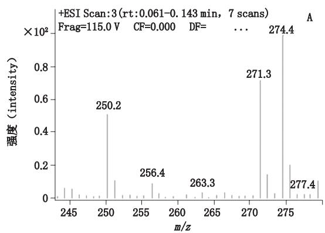

bar chart

| m/z   | 强度 (intensity) |
|-------|------------------|
| 250.2 | 0.5              |
| 256.4 | 0.1              |
| 263.3 | 0.1              |
| 271.3 | 0.7              |
| 274.4 | 0.9              |
| 277.4 | 0.2              |

图1　吗啉硝唑（A）、吗啉硝唑 $- d _ { 8 } \left( \textbf { B } \right)$ 一级质谱图  
Fig. 1 Mass spectrograms of morinidazole（A）and morinidazole-d（B）

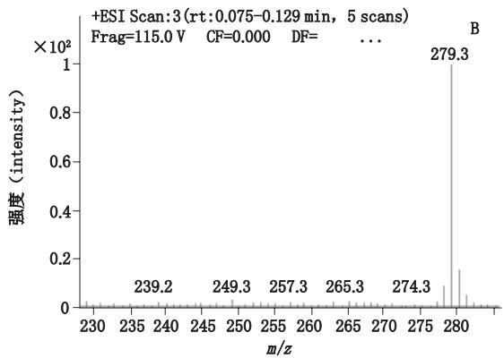

line chart

| m/z   | Intensity |
|-------|---------|
| 239.2 | ~0      |
| 249.3 | ~0      |
| 257.3 | ~0      |
| 265.3 | ~0      |
| 274.3 | ~0      |
| 279.3 | 1.0     |

## 2.3 工作液配制

精密称取 R 吗啉硝唑对照品 和S 吗啉硝唑对照品 ，分别置于 量瓶中，加甲醇溶解并稀释至刻度，得到质量浓度分别为$\mathrm { m g \cdot m L ^ { - 1 } }$ 和 $1 . 0 2 2 ~ \mathrm { m g \cdot m L ^ { - 1 } }$ 的溶液，并用甲醇继续稀释，制得 $1 0 0 ~ { \mu \mathrm { g } } \cdot \mathrm { m L } ^ { - 1 }$ 的R- 吗啉硝唑对照品储备液和S 吗啉硝唑对照品储备液。取同等体积$\mu \mathrm { g } \cdot \mathrm { m L } ^ { - 1 }$ 的 种对照品储备液均匀混合，并用甲醇稀释得到质量浓度为 $0 . 1 \setminus 0 . 2 \setminus 0 . 6 \setminus 1 \setminus 2 \setminus 6 \setminus 2 0 \mu _ { \mathrm { g } } \cdot \mathrm { m L } ^ { - 1 }$ 的标准曲线工作液；取同等体积的 种对照品储备液均匀混合，并用甲醇逐级稀释得到质量浓度为 、$1 0 , 1 6 , 5 0 ~ \mu \mathrm { g } \cdot \mathrm { m L } ^ { - 1 }$ 的质控工作液。精密称取内标吗啉硝唑 $- d _ { 8 } 1 0 . 6 3 \mathrm { m g }$ 于 量瓶中，加甲醇溶解并稀释至刻度，得质量浓度为 $1 . 0 6 3 ~ \mathrm { m g \cdot m L ^ { - 1 } }$ 内标储备液，并继续用甲醇稀释得到质量浓度为 $1 ~ { \mu \mathrm { g } } \cdot \mathrm { m L } ^ { - 1 }$ 的内标工作液。各工作液分别置 ℃冰箱中冷藏备用。

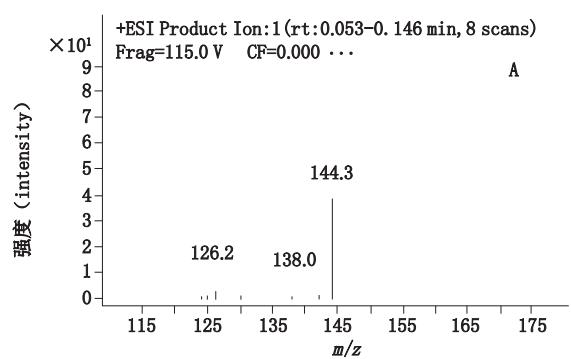

bar chart

| m/z   | 强度 (intensity) |
|-------|------------------|
| 126.2 | 1                |
| 138.0 | 1                |
| 144.3 | 9                |

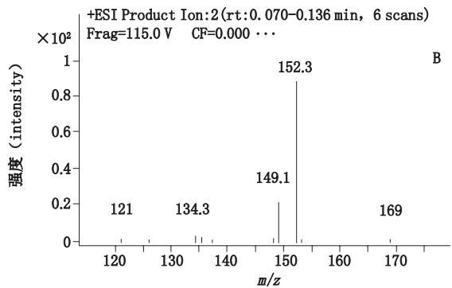

line chart

| m/z   | 强度 (intensity) |
|-------|------------------|
| 121   | 0                |
| 134.3 | 0                |
| 149.1 | 0                |
| 152.3 | 1                |
| 169   | 0                |

图2 吗啉硝唑（A）、吗啉硝唑-d（B）二级质谱图  
Fig. 2 Mass spectrograms of morinidazole（A）and morinidazole-d（B）

## 2.4 样品采集

雄性 大鼠 只，随机分为 组， 组为对照组， 组为实验组。其中， 组吗啉硝唑氯化钠注射液［称取220 mg吗啉硝唑，加 0.9%氯化钠注射液（生理盐水）22 mL，配制成质量浓度为 10 mg·$\mathrm { m } \mathrm { L } ^ { - 1 }$ 的溶液，即得］腹腔注射 $\left( 5 0 \mathrm { \ m g \cdot k g ^ { - 1 } } \right)$ ）；B组丙磺舒氯化钠混悬液（称取 丙磺舒，加生理盐水5 mL，配制成质量浓度为 $4 0 ~ \mathrm { { m g } \cdot \mathrm { { m L } ^ { - 1 } } }$ 的混悬液，即得）灌胃 $( \ 1 0 0 \ \mathrm { m g \cdot k g ^ { - 1 } } \ .$ ）30 min后吗啉硝唑氯化钠注射液腹腔注射 $( \ 5 0 \mathrm { m g \cdot k g ^ { - 1 } }$ ）； 组西咪替丁氯化钠混悬液（称取 丙磺舒，加生理盐水 ，配制成质量浓度为 $2 0 \mathrm { m g \cdot m L ^ { - 1 } }$ 的混悬液，即得）灌胃（80$\mathrm { m g } \cdot \mathrm { k g } ^ { - 1 } ) 3 0 \ \mathrm { m i n }$ 后吗啉硝唑氯化钠注射液腹腔注射 $\left( 5 0 \mathrm { \ m g \cdot k g ^ { - 1 } } \right)$ ； 组二甲双胍氯化钠溶液（称取$2 0 0 ~ \mathrm { m g }$ 二甲双胍，加生理盐水8 mL，配制成质量浓度为 $2 5 ~ \mathrm { m g \cdot m L ^ { - 1 } }$ 的溶液，即得）连续灌胃 7 d（100$\mathrm { m g \cdot k g ^ { - 1 } }$ ），第 7天灌胃30 min后吗啉硝唑氯化钠注射液腹腔注射 $\left( 5 0 \mathrm { \ m g \cdot k g ^ { - 1 } } \right)$ ）； 组替诺福韦氯化钠溶液（称取 替诺福韦，加生理盐水 ，配制成质量浓度为 $2 . 5 ~ \mathrm { m g \cdot m L ^ { - 1 } }$ 的溶液，即得）连续灌胃7 $\mathrm { d } \left( \ 1 0 \ \mathrm { m g \cdot k g ^ { - 1 } } \right)$ ），第 天灌胃后 吗啉硝唑氯化钠注射液静脉注射 $( 5 0 ~ \mathrm { m g } \cdot \mathrm { k g } ^ { - 1 } )$ ）。每组大鼠分别在给药前（ ）以及给药后 、 、 、 和 、、、、、 、 、 、 尾静脉段位取血，置于含有肝素离心管中，血样涡旋 ，离心 $( 4 \mathrm { \Phi ^ { \circ } C } , 3 5 0 0 \mathrm { \bf r \cdot m i n } ^ { - 1 } ) 1 0 \mathrm { \ m i n }$ 分离血浆，于 ℃保存。

## 2.5 血浆样品处理

血浆于室温解冻后涡旋 30 s，取血浆 $2 5 ~ \mu \mathrm { L }$ 置1.5 mL离心管中，分别加入内标工作液 ${ \bf \Phi } ( \mathrm { ~ 1 ~ } \mu \mathrm { g } \cdot \mathrm { m L } ^ { - 1 } )$ ）$5 ~ \mu \mathrm { L }$ ，甲醇 $7 5 ~ \mu \mathrm { L }$ ，涡旋 30 s，离心 $( \ 1 5 \ 0 0 0 \ \mathrm { r \cdot m i n ^ { - 1 } }$ ，10）后取上清液 μ 进样。

## 2.6 样品方法学考察

2.6.1 方法特异性　取空白血浆、空白血浆加吗啉硝唑 $( \ 5 \ \mathrm { n g \cdot m L ^ { - 1 } } \ )$ ）、内标 $\left( 2 0 0 \mathrm { n g \cdot m L ^ { - 1 } } \right)$ ）以及大鼠用药1 h 后的血浆各25 μL，经样品进样前处理后分别采用 系统进样分析，观察、比较色谱图，见图 。混合对照品及给药后对照组大鼠血浆样品的总离子流色谱图见图 $4 _ { \circ }$ 。结果R 吗啉硝唑和S 吗啉硝唑的保留时间分别为 和 ，内标的保留时间为（R 吗 啉 硝 $\sharp \underline { { \sharp } } \operatorname { - \mathcal { d } } _ { 8 } \operatorname { ) }$ 和 （S 吗 啉 硝唑 $- d _ { 8 } \ )$ ），空白血浆的内源性物质不干扰吗啉硝唑的测定。

2.6.2 线性关系考察　精密移取“ ”项系列标准曲线工作液各 $5 ~ \mu \mathrm { L }$ ，分别加入空白血浆 $9 5 ~ \mu \mathrm { L }$ ，配制成 质 量 浓 度 为 5、10、30、50、100、300 和 1 000 ng·$\mathrm { m } \mathrm { L } ^ { - 1 }$ 的R 吗啉硝唑和S 吗啉硝唑标准曲线血浆样$\Pi _ { \mathrm { ~ G I I ~ G ~ } }$ 。配制所得的血浆样品分别按“ ”项方法处理，测定峰面积。以 R 吗啉硝唑和S 吗啉硝唑的子离子峰面积与相应内标子离子峰面积的比值（Y）对相应浓度（X）采用加权 $( 1 / X ^ { 2 } )$ ）最小二乘法进行线性回归。R 吗啉硝唑和S 吗啉硝唑质量浓度在$\mathrm { n g \cdot m L ^ { - 1 } }$ 范围内，回归方程分别为

$$
Y = 2. 1 1 6 5 X - 0. 0 0 1 5 r ^ {2} = 0. 9 9 8 0
$$

$$
Y = 2. 0 2 2 4 X + 0. 0 0 1 4 r ^ {2} = 0. 9 9 8 5
$$

本文所建立的方法定量下限为 $5 ~ \mathrm { n g } \cdot \mathrm { m L } ^ { - 1 }$ 。

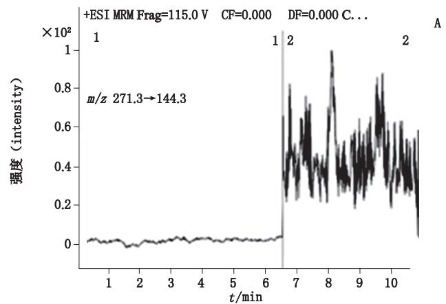

line chart

| t/min | 强度 (intensity) |
|-------|------------------|
| 1     | ~0               |
| 2     | ~0               |
| 3     | ~0               |
| 4     | ~0               |
| 5     | ~0               |
| 6     | ~0               |
| 7     | ~0.8             |
| 8     | ~1.0             |
| 9     | ~0.8             |
| 10    | ~0.6             |

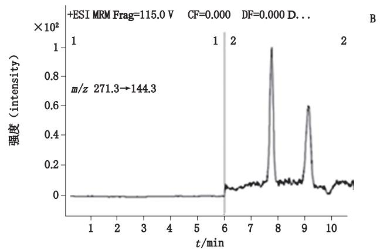

line chart

| t/min | 强度 (intensity) |
|-------|------------------|
| 6     | 0                |
| 8     | 100              |
| 9     | 60               |

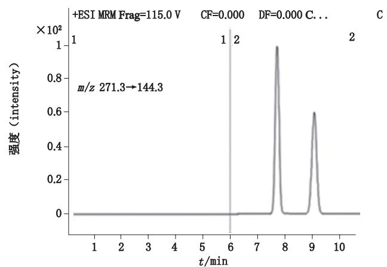

line chart

| t/min | 强度 (intensity) |
|-------|------------------|
| 6     | 0                |
| 8     | 1×10²            |
| 9     | 0.6×10²          |

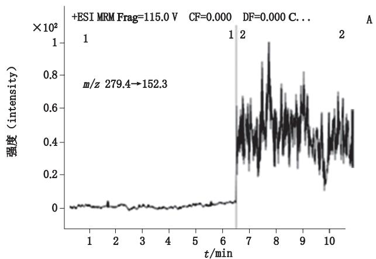

line chart

| t/min | 强度 (intensity) |
|-------|------------------|
| 1     | ~0               |
| 2     | ~0               |
| 3     | ~0               |
| 4     | ~0               |
| 5     | ~0               |
| 6     | ~0               |
| 7     | ~0.8             |
| 8     | ~1.0             |
| 9     | ~0.8             |
| 10    | ~0.6             |

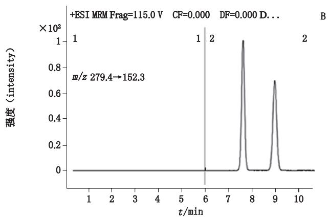

line chart

| t/min | 强度 (intensity) |
|-------|------------------|
| 6     | 0                |
| 8     | 100              |
| 9     | 70               |

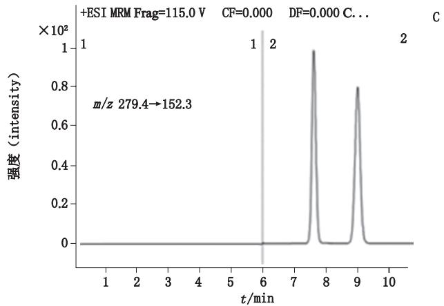

line chart

| t/min | 强度 (intensity) |
|-------|------------------|
| 6     | 0                |
| 8     | 100              |
| 9     | 80               |

A. 空白血浆（blank plasma）　B. 空白血浆加吗啉硝唑 $\left( 5 \mathrm { \ n g \cdot m L ^ { - 1 } } \right)$ 和内标（ $5 ~ \mathrm { n g } \cdot \mathrm { m L } ^ { - 1 }$ morinidazole in blank plasma along with internal standard） C. 给药后 1 h 大鼠血浆（plasma sample from a rat at 1 h after an administration of morinidazole）

图3　吗啉硝唑和内标的典型色谱图

Fig. 3 Chromatograms of morinidazole and internal standard

2.6.3 回收率和精密度　移取 $^ { \ast } 2 . 3 ^ { \prime \prime }$ ”项系列质控工作液 μ ，分别加入空白血浆 $9 5 ~ \mu \mathrm { L }$ ，配制质量浓度为5（定量下限）、 $1 5 , 5 0 0 , 8 0 0 \mathrm { n g } \cdot \mathrm { m L } ^ { - 1 }$ 的R-吗啉硝唑和S 吗啉硝唑质控血浆样品各 份，分别按照$^ { 6 6 } 2 . 5 \ '$ ”项下方法处理，考察日内的准确度［ ：（测定值的均值与标示值之差 标示值）× ］和精密度（ ）（n ）；按此法测定 ，计算日间 和$\mathrm { R S D } \left( \mathrm { \Omega } n = 3 \mathrm { \Omega } \right)$ ）。日间、日内 均小于 ，平均回收率在 ，结果见表 。

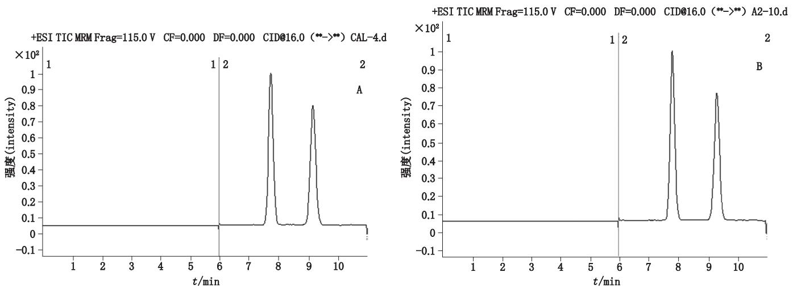  
图4　混合对照品（A）及给药7 h后对照组大鼠血浆样品（B）的总离子色谱图  
Fig. 4 TIC of mixed reference substances（A）and plasma sample from a rat at 7 h after an administration of morinidazole（B）

表1　回收率（准确度）及精密度结果  
Tab. 1 Results of recovery and precision

<table><tr><td rowspan="2">成分(component)</td><td rowspan="2">浓度(concentration)/(ng·mL-1)</td><td colspan="2">平均回收率(average recovery)/%</td><td colspan="2">精密度(precision),RSD)/%</td></tr><tr><td>日内(intra-day)</td><td>日间(inter-day)</td><td>日内(intra-day)</td><td>日间(inter-day)</td></tr><tr><td rowspan="4">R-吗啉硝唑(R-morinidazole)</td><td>5</td><td>106.9</td><td>101.2</td><td>3.8</td><td>6.1</td></tr><tr><td>15</td><td>91.9</td><td>93.4</td><td>3.2</td><td>3.5</td></tr><tr><td>500</td><td>97.8</td><td>101.5</td><td>3.3</td><td>5.4</td></tr><tr><td>800</td><td>93.4</td><td>98.4</td><td>5.3</td><td>5.7</td></tr><tr><td rowspan="4">S-吗啉硝唑(S-morinidazole)</td><td>5</td><td>101.7</td><td>99.7</td><td>7.0</td><td>8.3</td></tr><tr><td>15</td><td>88.7</td><td>94.4</td><td>3.2</td><td>5.2</td></tr><tr><td>500</td><td>91.9</td><td>98.8</td><td>3.4</td><td>6.8</td></tr><tr><td>800</td><td>90.9</td><td>96.6</td><td>1.9</td><td>4.8</td></tr></table>

2.6.4 稀释线性　由于R 吗啉硝唑与S 吗啉硝唑在大鼠血浆中的浓度较高，跨度范围较大，对高浓度样本需要进行稀释处理，本研究考察了 倍、 倍样品稀释的稀释效应。将质量浓度为 $2 . 5 ~ { \mu \mathrm { g } } \cdot \mathrm { m L } ^ { - 1 }$ 的R 吗啉硝唑、S 吗啉硝唑混合对照品溶液用空白血浆经“ ”项方法沉淀后的基质分别稀释到 、$\mathrm { n g \cdot m L ^ { - 1 } }$ 后进样测定，结果表明稀释10倍后，R-吗啉硝唑的 和 （n ）分别为 和 ，S吗啉硝唑的 和 （n ）分别为 和 ；稀释 倍后，R 吗啉硝唑的 和 （n ）分别为 和 ，S 吗啉硝唑的 和 （n ）分别为 和 ，均符合方法学要求，表明倍和 倍稀释后，样品的精密度和准确度不受影响。

2.6.5 稳定性试验　取干净 离心管数支，按“ ”项方法制备含R 吗啉硝唑、S 吗啉硝唑 、· -1 个浓度水平的质控血浆样本若干份，室温下放置 及反复冻融循环 次及 ℃冻存，每次均按上述色谱条件分析测定，结果显示含量无明显变化， 小于 ，吗啉硝唑血浆样品室温下放置 及反复冻融循环 次及 ℃冻存后稳定性良好，见表 。

## 2.7 药代动力学研究

按“ ”项方法采集 组大鼠血浆样品，分别按“ ”项下方法操作后，利用 软件计算可得血浆中R 吗啉硝唑与S 吗啉硝唑的药动学参数（表 ），利用 软件做平均血药浓度 时间曲线（图 ），采用t检验可得丙磺舒、西咪替丁、二甲双胍、替诺福韦与吗啉硝唑联用对大鼠体内R 吗啉硝唑、S 吗啉硝唑的药代动学并未产生显著性影响。

表2　稳定性考察结果（n=3）  
Tab. 2 Results of stability study

<table><tr><td rowspan="2" colspan="2">稳定性条件(stability condition)</td><td colspan="2"> $R-$ 吗啉硝唑( $R-morinidazole$ )</td><td colspan="2"> $S-$ 吗啉硝唑( $S-morinidazole$ )</td></tr><tr><td> $15\ ng\cdot mL^{-1}$ </td><td> $800\ ng\cdot mL^{-1}$ </td><td> $15\ ng\cdot mL^{-1}$ </td><td> $800\ ng\cdot mL^{-1}$ </td></tr><tr><td rowspan="2">室温放置5 h(untreated blood sample at room temperature for 5 h)</td><td>均值(mean) $\pm$ SD/ $(ng\cdot mL^{-1})$ </td><td> $14.38 \pm 1.54$ </td><td> $832.17 \pm 37.24$ </td><td> $14.81 \pm 0.17$ </td><td> $826.73 \pm 8.55$ </td></tr><tr><td>RSD/%</td><td>0.92</td><td>2.4</td><td>1.1</td><td>1.0</td></tr><tr><td rowspan="2">上样液放置24 h(treated blood sample in autosampler at room temperature for 24 h)</td><td>均值(mean) $\pm$ SD/ $(ng\cdot mL^{-1})$ </td><td> $16.31 \pm 1.36$ </td><td> $859.73 \pm 18.54$ </td><td> $15.19 \pm 0.44$ </td><td> $828.73 \pm 11.20$ </td></tr><tr><td>RSD/%</td><td>8.3</td><td>2.2</td><td>2.9</td><td>1.4</td></tr><tr><td rowspan="2">-70 °C 3次冻融(three freeze-thaw cycles at -70 °C)</td><td>均值(mean) $\pm$ SD/ $(ng\cdot mL^{-1})$ </td><td> $14.35 \pm 0.79$ </td><td> $830.88 \pm 14.03$ </td><td> $15.18 \pm 0.80$ </td><td> $863.80 \pm 25.46$ </td></tr><tr><td>RSD/%</td><td>5.5</td><td>1.7</td><td>5.3</td><td>3.0</td></tr><tr><td rowspan="2">冻存49 d(storage at -20 °C for 49 d)</td><td>均值(mean) $\pm$ SD/ $(ng\cdot mL^{-1})$ </td><td> $14.47 \pm 0.27$ </td><td> $880.01 \pm 7.21$ </td><td> $16.23 \pm 0.82$ </td><td> $902.86 \pm 13.17$ </td></tr><tr><td>RSD/%</td><td>1.8</td><td>0.80</td><td>5.1</td><td>1.5</td></tr></table>

表3　吗啉硝唑分别联用丙磺舒、西咪替丁、二甲双胍、替诺福韦后大鼠体内R-吗啉硝唑、S-吗啉硝唑的药动学参数

Tab. 3 Main pharmacokinetic parameters after administrations of morinidazole alone or in combination with probenecid， cimetidine，metformin，tenofovir in rats

<table><tr><td>分析物( analyte )</td><td>处理(treatment )</td><td> $T_{\text{max}}/\text{h}$ </td><td> $C_{\text{max}}/(\mu\text{g}\cdot\text{mL}^{-1})$ </td><td> $AUC_{0\rightarrow t}/(\text{h}\cdot\mu\text{g}\cdot\text{mL}^{-1})$ </td><td> $AUC_{0\rightarrow\infty}/(\text{h}\cdot\mu\text{g}\cdot\text{mL}^{-1})$ </td><td> $t_{1/2}/\text{h}$ </td><td> $MRT_{0\rightarrow t}/\text{h}$ </td></tr><tr><td rowspan="5">R-吗啉硝唑(R-morinidazole )</td><td>M</td><td>0.30 ± 0.14</td><td>11.11 ± 4.90</td><td>14.47 ± 6.03</td><td>14.51 ± 6.04</td><td>2.18 ± 1.21</td><td>1.29 ± 0.38</td></tr><tr><td>M+P</td><td>0.37 ± 0.14</td><td>10.15 ± 5.40</td><td>14.13 ± 6.64</td><td>14.28 ± 6.55</td><td>5.34 ± 3.66</td><td>1.75 ± 0.75</td></tr><tr><td>M+C</td><td>0.32 ± 0.19</td><td>11.16 ± 7.47</td><td>13.61 ± 7.23</td><td>13.67 ± 7.22</td><td>2.14 ± 0.96</td><td>1.61 ± 0.56</td></tr><tr><td>M+E</td><td>0.47 ± 0.08</td><td>7.94 ± 5.14</td><td>16.40 ± 11.93</td><td>16.48 ± 11.97</td><td>9.47 ± 10.79</td><td>1.61 ± 0.45</td></tr><tr><td>M+T</td><td>0.43 ± 0.09</td><td>9.90 ± 3.44</td><td>18.03 ± 6.95</td><td>18.05 ± 6.94</td><td>1.40 ± 0.66</td><td>1.40 ± 0.09</td></tr><tr><td rowspan="5">S-吗啉硝唑(S-morinidazole )</td><td>M</td><td>0.30 ± 0.14</td><td>11.23 ± 4.91</td><td>12.63 ± 5.47</td><td>12.65 ± 5.48</td><td>1.74 ± 1.38</td><td>1.13 ± 0.44</td></tr><tr><td>M+P</td><td>0.30 ± 0.14</td><td>9.40 ± 5.90</td><td>10.72 ± 6.02</td><td>10.89 ± 6.70</td><td>3.03 ± 4.51</td><td>1.32 ± 0.81</td></tr><tr><td>M+C</td><td>0.42 ± 0.36</td><td>11.96 ± 8.41</td><td>15.83 ± 10.25</td><td>15.89 ± 10.23</td><td>4.55 ± 5.56</td><td>1.78 ± 0.84</td></tr><tr><td>M+E</td><td>0.40 ± 0.09</td><td>8.09 ± 5.56</td><td>14.36 ± 10.71</td><td>14.42 ± 10.73</td><td>6.14 ± 9.10</td><td>1.47 ± 0.40</td></tr><tr><td>M+T</td><td>0.43 ± 0.09</td><td>10.13 ± 4.02</td><td>16.72 ± 7.46</td><td>16.74 ± 7.46</td><td>1.15 ± 0.73</td><td>1.26 ± 0.06</td></tr></table>

注（ ）： 吗啉硝唑（ ）； 丙磺舒（ ）； 西咪替丁（ ）； 二甲双胍（ ）； 替诺福韦（ ）

## 3　讨论

本文借鉴已报道的吗啉硝唑手性拆分方法［15］，简化样本处理过程，对实验的 大鼠血浆样本进行了吗啉硝唑的手性拆分与定量分析。以本文所建立的方法分析样品时，R 吗啉硝唑和内标 R 吗啉硝唑 $- d _ { 8 }$ 保留时间分别为 、 ，S 吗啉硝唑以及内标S 吗啉硝唑 $- d _ { 8 }$ 的保留时间分别为、 ，分析物和内标的色谱峰相互重叠，未能完全分离但不会影响检测结果。采用经过色谱柱分离， 综合使用了保留时间、母离子、子离子和实验参数等条件，为目标物的分析提供了高水平的选择性，通过设置多通道监测方式（ ）选择最佳母离子，优化碰撞能量，得到子离子碎片再进行分析测定。 检测器选择药物的特征子离子碎片吗啉硝唑m/z → m/z ，内标m/z →m/z 进行分析，结果不会受到影响。

体外研究显示，S 吗啉硝唑抗寄生虫活性强于R-吗啉硝唑［16］，2个对映体在体内的代谢过程目前尚未研究，按照 的指导原则，需要对其安全性给予关注［17］ 。在药物- 药物相互作用方面，已有临床研究证明在健康人体内利福平、酮康唑与吗啉硝唑联用后，吗啉硝唑的代谢无明显变化，代谢物 与M8-2 的 $C _ { \mathrm { m a x } }$ 稍有变化但认为不造成显著影响［18］ ；吗啉硝唑与华法林联用时，对 R 华法林和 S 华法林的代谢均无显著影响［19］ 。本文采用技术，利用手性柱将 R 吗啉硝唑与 S 吗啉硝唑进行了手性拆分并定量，首次证明丙磺舒、西咪替丁、二甲双胍和替诺福韦对大鼠体内 R 吗啉硝唑和 S吗啉硝唑的药动学并未产生显著影响。本次试验并未检测尿中R 吗啉硝唑和S 吗啉硝唑以及吗啉硝唑的代谢物浓度是否发生改变，后续还需继续深入。另外，随着计算机技术的发展，利用计算机开发了基于生理学的药代动力学（ ）模型。研究人员常利用计算机分析方法使体外和体内方法相互补充，也可用于药物 - 药物相互作用的预测［20］ 。例如，中 模块可预测基于代谢酶或转运体影响的药物相互作用［21］，本实验获得的一些参数可应用于吗啉硝唑 PBPK模型的建立以及临床药物相互作用的预测。

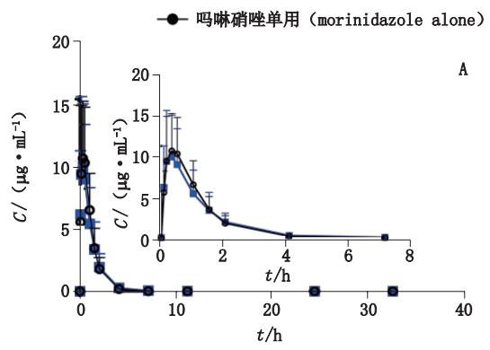

line chart

| t/h | C/ (μg·mL⁻¹) |
| --- | ------------ |
| 0   | 15           |
| 1   | 10           |
| 2   | 5            |
| 3   | 2            |
| 4   | 1            |
| 5   | 0.5          |
| 6   | 0.2          |
| 7   | 0.1          |
| 8   | 0.05         |

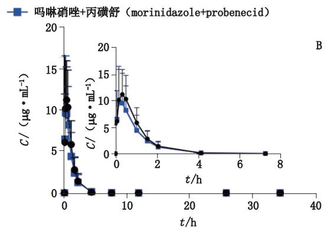

line chart

| t/h | C/ (μg·mL⁻¹) - 吗啉硝唑+丙磺舒 (morinidazole+probenecid) |
| --- | --- |
| 0 | 16.0 |
| 5 | 10.0 |
| 10 | 6.0 |
| 15 | 3.0 |
| 20 | 1.0 |
| 25 | 0.5 |
| 30 | 0.2 |
| 35 | 0.1 |
| 40 | 0.0 |

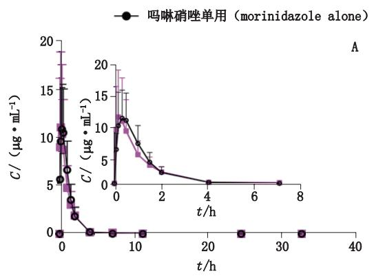

line chart

| t/h | C (μg·mL⁻¹) |
| --- | ----------- |
| 0   | 10          |
| 1   | 5           |
| 2   | 2           |
| 3   | 1           |
| 4   | 0.5         |
| 5   | 0.2         |
| 6   | 0.1         |
| 7   | 0.05        |
| 8   | 0.02        |

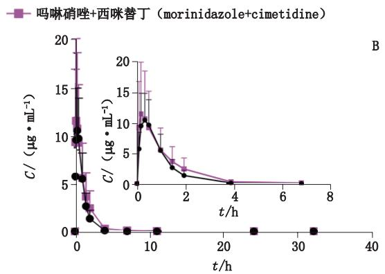

line chart

| t/h | C/(μg·mL⁻¹) - 吗啉硝唑+西咪替丁 (morinidazole+cimetidine) | C/(μg·mL⁻¹) - 吗啉硝唑+西咪替丁 (morinidazole+cimetidine) |
| --- | --- | --- |
| 0 | 18.0 | 12.0 |
| 5 | 6.0 | 3.0 |
| 10 | 1.0 | 0.5 |
| 15 | 0.5 | 0.2 |
| 20 | 0.2 | 0.1 |
| 25 | 0.1 | 0.05 |
| 30 | 0.05 | 0.02 |
| 35 | 0.02 | 0.01 |
| 40 | 0.01 | 0.005 |

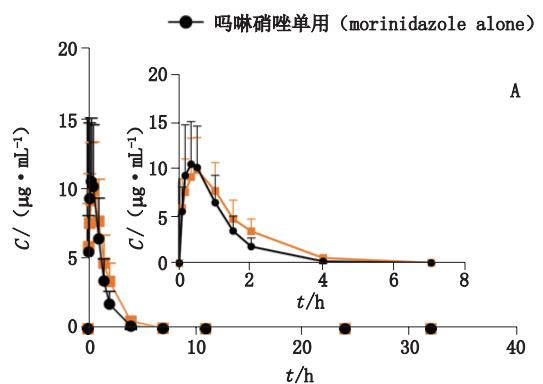

line chart

| t/h | C/ (μg·mL⁻¹) - 吗啉硝唑单用 (morinidazole alone) | C/ (μg·mL⁻¹) - 吗啉硝唑单用 (morinidazole alone) |
| --- | --- | --- |
| 0 | 15.0 | 10.0 |
| 2 | 5.0 | 3.0 |
| 4 | 0.0 | 0.0 |
| 6 | 0.0 | 0.0 |
| 8 | 0.0 | 0.0 |

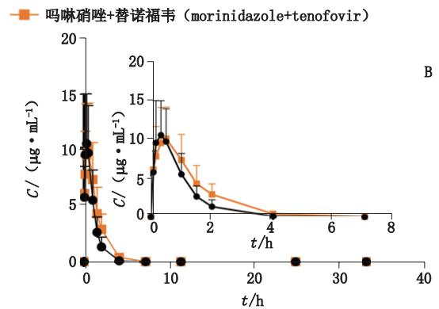

line chart

| t/h | C/ (μg·mL⁻¹) - 吗啉硝唑+替诺福韦 (morinidazole+tenofovir) |
| --- | --- |
| 0   | 15.0 |
| 1   | 10.0 |
| 2   | 5.0 |
| 4   | 0.0 |
| 8   | 0.0 |

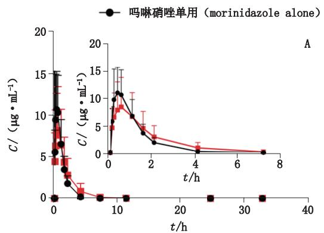

line chart

| t/h | C/ (μg·mL⁻¹) - Black Line | C/ (μg·mL⁻¹) - Red Line |
| --- | -------------------------- | ------------------------ |
| 0   | 15                         | 12                       |
| 1   | 10                         | 8                        |
| 2   | 5                          | 4                        |
| 3   | 2                          | 2                        |
| 4   | 1                          | 1                        |
| 5   | 0.5                        | 0.5                      |
| 6   | 0.2                        | 0.2                      |
| 7   | 0.1                        | 0.1                      |
| 8   | 0                          | 0                        |

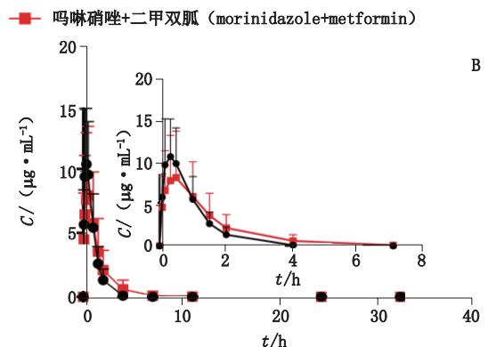

line chart

| t/h | C/ (μg·mL⁻¹) - 吗啉硝唑+二甲双胍 (morinidazole+metformin) |
| --- | --- |
| 0 | 15.0 |
| 1 | 10.0 |
| 2 | 5.0 |
| 4 | 2.0 |
| 6 | 1.0 |
| 8 | 0.5 |

图5　吗啉硝唑联用丙磺舒、西咪替丁、替诺福韦、二甲双胍后大鼠体内 R-吗啉硝唑（A）、S-吗啉硝唑（B）的平均药 -时曲线（均值 ±SD，n=5）  
Fig. 5 Mean plasma concentration-time curves of R-morinidazole（A），S-morinidazole（B）after administration of morinidazole alone and incombination with probenecid，cimetidine，metformin or tenofovir in rats（mean±SD，n=5）

## 参考文献

［1］ KEDDERIS GL，ARGENBRIGHT LS，MIWA GT．Covalentinteraction of 5-nitroimidazoles with DNA and protein in vitro：mechanism of reductive activation［J］．Chem Res Toxicol，1989，2（3）：146  
［2］ LV A．Usage of Alpha-（Morpholin-1-Base）Methyl-2-Methyl-5- Azathio-1-Alcohol in Preparation of Anti-trichomoniasis and Antiameba Medicines:China,1981764A[P].2005-12-13  
［3］ CAO C，LUO A，WU P，et al．Efficacy and safety of morinidazole inpelvic inflammatory disease：results of a multicenter，double-blind，randomized trial［J］．Eur J Clin Microbiol Infect Dis，2017，36（7）：1225  
［4］ GAO R，LI L，XIE C，et al．Metabolism and pharmacokinetics of morinidazole in humans：identification of diastereoisomeric morpholine N+ -glucuronides catalyzed by UDP glucuronosyltransferase 1A9［J］．Drug Metab Dispos，2012，40（3）：556  
［5］ ZHONG K，LI X，XIE C，et al．Effects of renal impairment on thepharmacokinetics of morinidazole：uptake transporter-mediatedrenal clearance of the conjugated metabolites[J].Antimicrob， ， （ ）：  
［6］ USFDA．Guidance for Industry：Drug Interactions Studies-Study Design，Data Analysis，Implications for Dosing and Labeling RecommendationsS.2012  
［7］ ITO S，KUSUHARA H，YOKOCHI M，et al．Competitive inhibition of the luminal efflux by multidrug and toxin extrusions，but not basolateral uptake by organic cation transporter 2，is the likely mechanism underlying the pharmacokinetic drug-drug interactions caused by cimetidine in the kidney[J].JPharmacol Exp Ther, ， （ ）：  
［ ］ CHENL,PAWLIKOWSKIB,SCHLESSINGERA,et al.Role oforganic cation transporter 3（SLC22A3）and its missense variantsin the pharmacologic action of metformin［J］．Pharmacogenet， ， （ ）：  
［ ］ ， ， ，et al．on urinary excretion of metformin via down-regulating multidrug and  
toxin extrusion protein 1（rMate1）expression in the kidney of rats［J］．Eur J Pharm Sci，2015，68：18  
［10］ UWAI Y，IDA H，TSUJI Y，et al．Renal transport of adefovir，cidofovir，and tenofovir by SLC22A family members（hOAT1，， ）［ ］． ， ， （ ）：  
［11］ TAN H，YANG G，YU P，et al．Simultaneous determination of morinidazole and its carbonylation metabolite in human plasma： application to a pharmacokinetic study involving renal insufficiency patients and healthy volunteers［J］．J Pharm Biomed Anal，2013， 76：75  
［ ］ ， ， ，et al．of morinidazole,its N-oxide,sulfate,and diastereoisomeric N-glucuronides in human plasma by liquid chromatography-tandemmass spectrometry［J］．J Chromatogr B Analyt Technol Biomed LifeSci，2012，908：52  
［13］ LV W．Investigation of the effects of 24 bio-matrices on the LC-MS/MS analysis of morinidazole［J］．Talanta，2010，80（3）：1406  
［14］ KONG F，PANG X，ZHONG K，et al．Increased plasma exposuresof conjugated metabolites of morinidazole in renal failure patients：acritical role of uremic toxins［J］．Drug Metab Dispos，2017，45（6）：593  
［15］ ZHONG K，GAO Z，LI Q，et al．A chiral high-performance liquid chromatography-tandem mass spectrometry method for the stereospecific determination of morinidazole in human plasma［J］．J Chromatogr B Analyt Technol Biomed Life Sci，2014，961：49  
［16］ 张仓，陶小鑫，滕再进．左旋吗啉硝唑在制备抗寄生虫感染药物中的用途：中国，1850086A［P］．2006-06-09ZHANG C，TAO XX，TENG ZJ．Application of Levo-morpholinidazolein Preparing Anti-parasitic Infection Medicine：China，1850086A［ ］．  
［17］ USFDA．Guidance for Industry：Safety Testing of Drug Metabolites［ ］．  
［18］ PANG X，ZHANG Y，GAO R，et al．Effects of rifampin andketoconazole on pharmacokinetics of morinidazole in healthy chinese［ ］． ， ， （ ）：  
［ ］ 金舒，张逸凡，陈笑艳，等．对映体选择性 法测定人血浆中 华法林及其在药物相互作用研究中的应用［ ］．药学学报，2012，47（1）：105JIN S,ZHANG YF,CHENXY,et al.Enantioselectiye determininationof R-warfarin/S-warfarin in human plasma using liquid chromatography-tandem mass spectrometry and its application in a drug-drug interaction［ ］． ， ， （ ）：  
［20］ CHOI SM，KANG CY，LEE BJ，et al．In vitro-in vivo correlationusing in silico modeling of physiological properties，metabolites，and［ ］． ， ， （ ）：  
［21］ Simulationplus．Gastroplus Quick Start Guide ［EB/OL］．［2018-05-16 ]. https : //www.simulations-plus.com

（本文于 年 月 日收到）